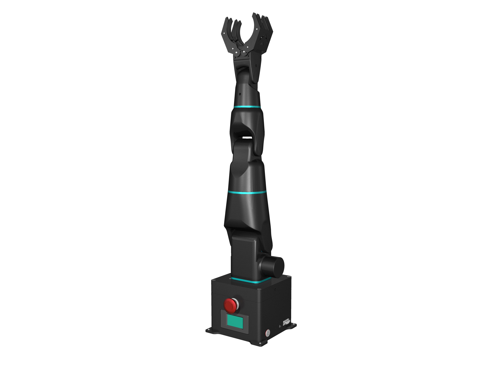
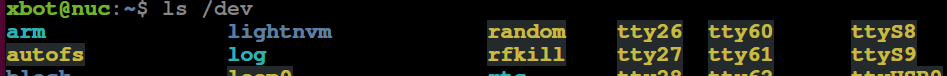
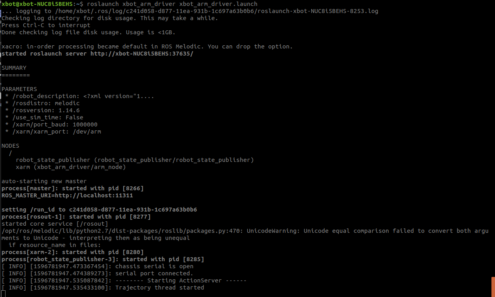
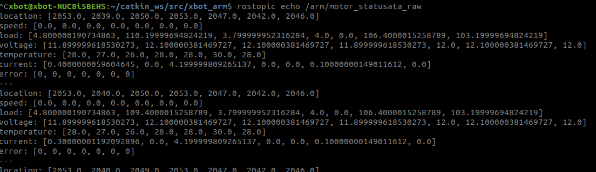

# 产品开箱与验收

## 前言

xbot_arm系列机械臂是重德智能研发的六自由度机械臂，可用于机械臂的科研教学平台，能满足机械臂运动控制、路径规划、力矩控制等算法的学习和验证，支持ROS开发。

目前xbot-arm系列共有三款机械臂产品方案:

- 桌面级机械臂
- 与xbot-u进行单臂集成的方案
- 与xbot-u进行双臂集成的方案

本使用手册适用于**桌面级机械臂**。



本手册共包含“安全须知”、“机械臂开箱和验收”、“产品介绍”、“快速上手机械臂”和“深入使用机械臂”四大部分。为了您的安全，在安装和使用机械臂进行开发前，必须严格遵守`安全须知`章节里的说明。

**机械臂开箱和验收**包含机械臂的开箱、快速启动和产品验收等内容，用户收到机械臂后，可以参考此章节进行机械臂的验收工作。“产品介绍”章节对机械臂的外观尺寸和技术参数等内容进行了详细说明。

"快速上手机械臂"章节介绍如何使用moveit和Rviz进行运动规划并控制xbot-arm。

“深入使用机械臂”章节详细介绍了机械臂各个软件功能包的作用、启动顺序和接口说明，用户可参考此章节内容进行机械臂的深入学习和二次开发。

本手册适用于：

- 客户工程师
- 销售工程师
- 安装调试工程师
- 技术支持工程师


## 安全须知

`！！！`首次使用机械臂前，请仔细阅读以下安全规则后再使用：

- 1.本产品应在符合要求的环境下使用，未经授权请勿改造产品，否则可能导致机械臂损坏甚至人身伤害。

- 2.请在规定的环境范围内使用机械臂，超出机械臂规格及负载条件使用会缩短产品的使用寿命甚至损坏设备。

- 3.未经专业培训人员不得擅自维修故障产品，不得擅自拆卸机械臂，若产品出现故障，请及时联系xbot-arm技术支持工程师。

- 4.机械臂属于带电设备，请勿随意更改线路，以免造成伤害。本产品应放置于远离儿童的位置，未成年在使用过程中必须有成年人在旁边监控和指导。

- 5.操作机械臂之前，请先参考用户手册(即本手册)。

- 6.启动机械臂驱动程序后机械臂会自动恢复到初始位置(竖直向上)，所以在运行程序前，请确保**机器人附近0.8米范围内无任何障碍物**，以免造成设备损坏。

- 7.在机械臂运动过程中，请勿将身体凑近机械臂的运动范围，**以免发生碰撞！**。

- 8.关闭机械臂时，机械臂同样会自动恢复至初始位置，请确保机械臂运动范围内无任何障碍物。


## 机械臂开箱和验收

### 机械臂开箱

机器人使用木质箱体进行装箱，其中填充泡沫塑料防撞。开箱时请将包装箱平放在地面，并将写有正面的一面朝上，使用扳手将包装箱上的螺钉拧下即可打开箱门。

### 机械臂安装

TODO: @谭建

### 机械臂验收单

机械臂验收内容如下表，请根据后面小节的步骤，运行机械臂程序，进行验收。

| 编号 | 验收项目         | 标准效果                                                     | 验收结果 |
| ---- | ---------------- | ------------------------------------------------------------ | -------- |
| 1    | 舵机返回数据正常 | rostopic echo /arm/motor_status/data_raw 查看话题消息，数据与当前状态匹配 |          |
| 2    | 关节1控制正常    | 键盘控制关节1转动，运动正常                                  |          |
| 3    | 关节2控制正常    | 键盘控制关节2转动，运动正常                                  |          |
| 4    | 关节3控制正常    | 键盘控制关节3转动，运动正常                                  |          |
| 5    | 关节4控制正常    | 键盘控制关节4转动，运动正常                                  |          |
| 6    | 关节5控制正常    | 键盘控制关节5转动，运动正常                                  |          |
| 7    | 关节6控制正常    | 键盘控制关节6转动，运动正常                                  |          |
| 8    | 手爪控制正常     | 键盘控制手爪开合，运动正常                                   |          |

### 启动机械臂

主机连接显示器和键盘鼠标设备，机械臂与主机连接。

运行机械臂相关程序前，请确保已经仔细阅读了前面的`安全须知`章节。在运行程序前，请确保`机器人附近0.8米范围内无任何障碍物`。

- 查看机械臂设备是否连接

“Ctrl Alt t”打开命令行终端，输入以下命令查看设备信息：

```
ls /dev
```

若如下图所示有**arm**端口，则说明机械臂usb已连接。若没有，请联系技术支持人员。



- 启动机械臂驱动程序

按“Ctrl Alt T”打开新的命令行终端，在终端内输入以下命令启动机械臂的驱动程序：

```
roslaunch xarm_driver xarm_driver.launch
```

程序运行后，若机械臂不在精确的初始位置上，则可看到机械臂会缓慢恢复到设定好的“初始位置”。程序界面如下：



- 查看舵机返回数据是否正常

“Ctrl Alt T”新开终端运行以下命令，可通过ROS topic查看机械臂各个关节舵机的状态:

```
rostopic echo /arm/motor_status/data_raw
```

话题显示如下图:



可看到七个舵机当前的位置(location)、速度(speed)、负载(load)、电压（volatge)、温度(temperature)、电流（curent）和错误码（error）信息。

每种状态信息以数组的形式给出，数组索引依次对应舵机编号0-6，其中**0号代表手爪舵机，1-6为从肩关节到手肘的六个舵机**。

location值与角度的对应关系为：0-4096对应角度 -180度—180度。机械臂刚启动位于初始位置时，舵机的location值均为2047（0度）左右。

**！注意：关闭xarm_driver.launch相关程序时，机械臂同样会自动恢复至初始状态（竖直向上），请注意机械臂的工作空间，防止碰撞。**


### 使用键盘控制机械臂

可以打开机械臂键盘控制程序，使用键盘控制机械臂的手爪开闭以及六个机械臂关节的转动。若机械臂能够正常运动，则符合验收要求。

“Ctrl Alt T”新开终端运行以下命令启动键盘控制程序：

```
 rosrun xarm_teleop simple_keyboard 
```

按照命令窗口提示的信息按键，可以控制机械臂运动。

| 键盘按键 | 控制动作                    |
| -------- | --------------------------- |
| r        | 第1个关节的角度增大0.15弧度 |
| f        | 第1个关节的角度减小0.15弧度 |
| t        | 第2个关节的角度增大0.15弧度 |
| g        | 第2个关节的角度减小0.15弧度 |
| y        | 第3个关节的角度增大0.15弧度 |
| h        | 第3个关节的角度减小0.15弧度 |
| u        | 第4个关节的角度增大0.15弧度 |
| j        | 第4个关节的角度减小0.15弧度 |
| i        | 第5个关节的角度增大0.15弧度 |
| k        | 第5个关节的角度减小0.15弧度 |
| o        | 第6个关节的角度增大0.15弧度 |
| l        | 第6个关节的角度减小0.15弧度 |
| n        | 张开手爪                    |
| m        | 闭合手爪                    |
| q        | 退出程序                    |

**注意**：

- 当您控制机器人运动发现机器人无反应时，请检查鼠标是否定位在上图所示的命令窗口且处于英文输入法状态。
- 由于执行动作需要时间，请在机械臂完成动作后再进行下一个控制。

