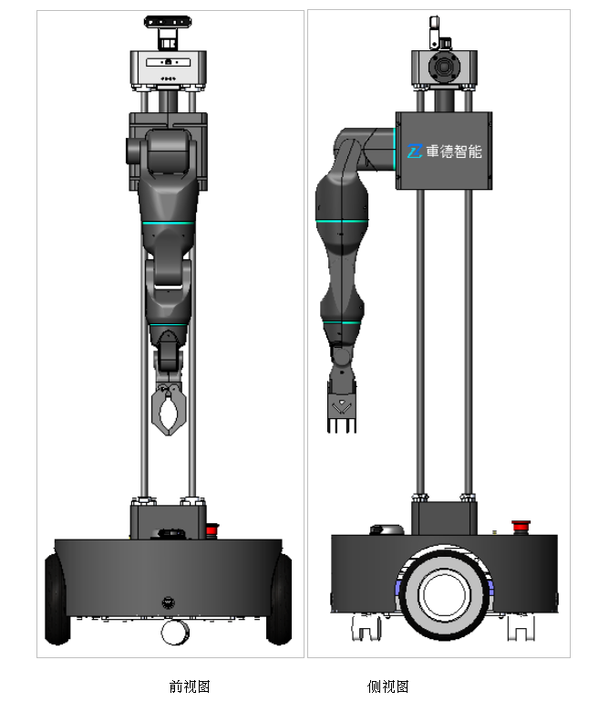
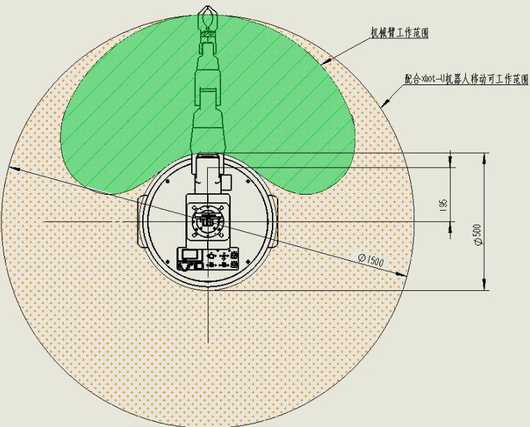
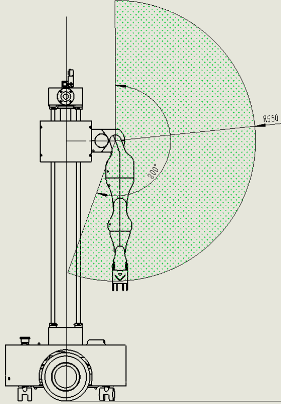
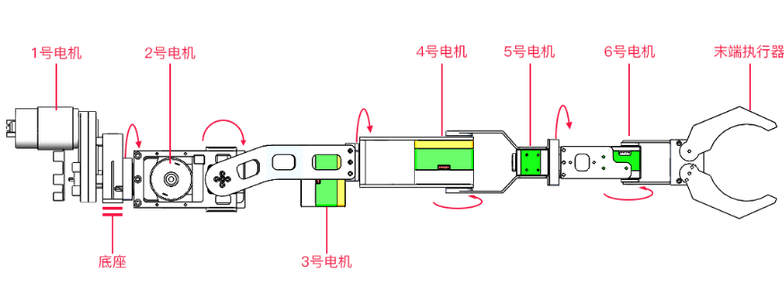
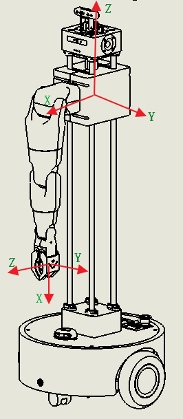
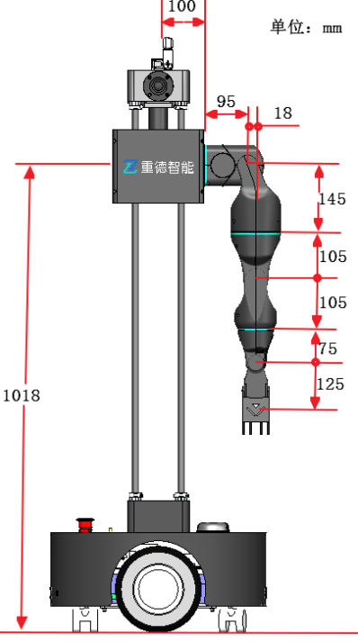

# 机械臂产品介绍

本章节将介绍xbot-arm机械臂的外观和技术参数等内容。

## 产品外观及构成

机械臂主要部件包含：内部结构件（安装底座+关节结构件）、高强度塑料外壳、执行电机、相关控制模块、末端执行器和Xbot-U基础版本体。

 

## 工作空间和坐标系

机械臂的工作空间范围如下面两张图所示：

 

机械臂的关节坐标系如下图：

笛卡尔坐标关系如下图：

## 技术规格

### 技术参数

| **项目描述**   | **规格**                               |
| -------------- | -------------------------------------- |
| 自重           | 约6Kg                                  |
| 额定负载       | 500g                                   |
| 最大负载       | 800g                                   |
| 工作范围       | 550mm                                  |
| 末端执行器范围 | 大于80°                                |
| 额定速度       | 所有腕关节：18°/s；末端执行关节：18°/s |
| 重复精度       | +-5mm                                  |
| 自由度         | 6关节+1执行                            |
| 工作半径       | 550mm                                  |
| 供电电源       | 12V                                    |
| 通讯接口       | RS485                                  |
| 待机功耗       | <200mA                                 |
| 平均功耗       | 2A                                     |
| 峰值功耗       | 10A                                    |
| 主体材料       | 高强度铝合金+ABS外壳                   |

### 关节角度限制

机械臂舵机的各个关节角度限制如下表：

| 关节     | 角度范围（单位rad） |
| -------- | ------------------- |
| 关节1    | -2.094  ～  2.094   |
| 关节2    | -0.5235 ～ 3.14     |
| 关节3    | -2.79 ～ 2.79       |
| 关节4    | -1.92 ～ 1.92       |
| 关节5    | -2.79 ～ 2.79       |
| 关节6    | -1.57 ～ 1.57       |
| 末端手爪 | 0 ～ 0.69           |

### 尺寸参数

