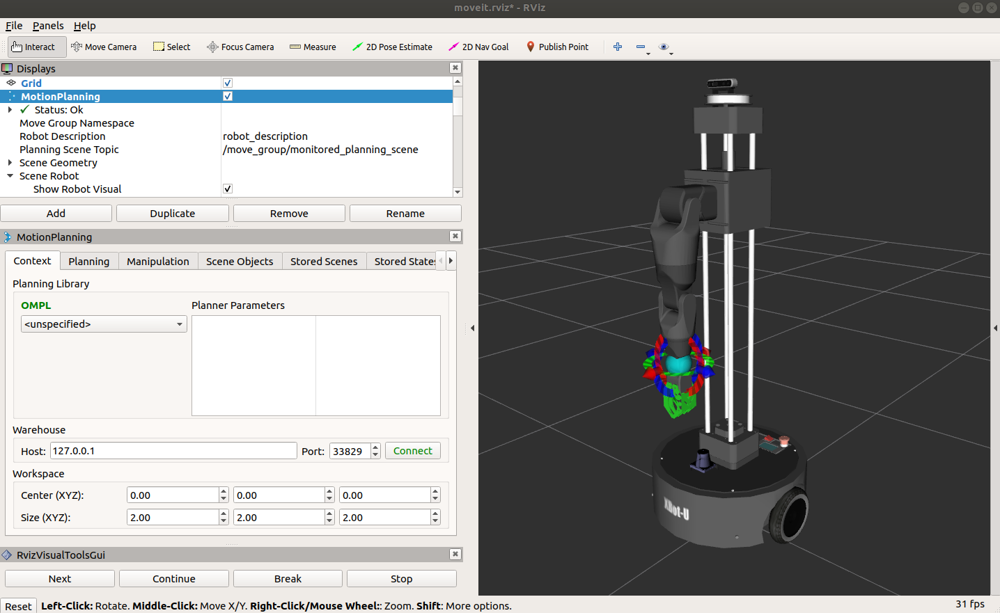
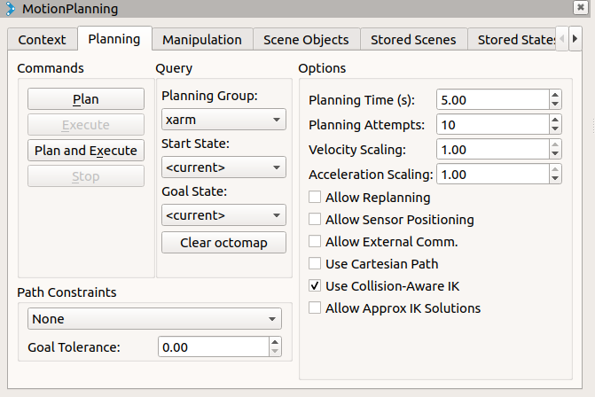
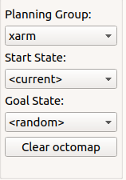
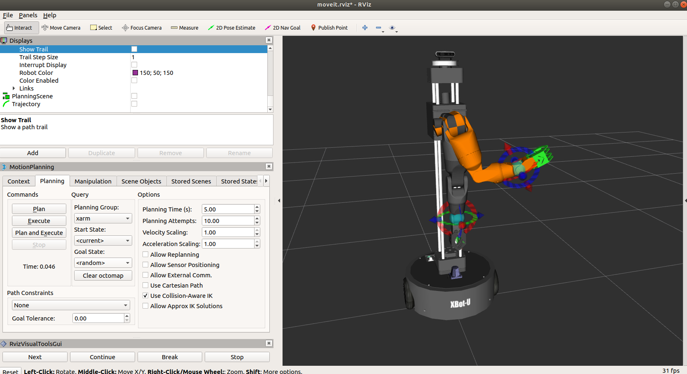
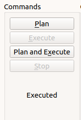
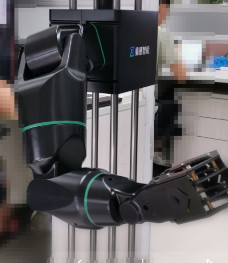
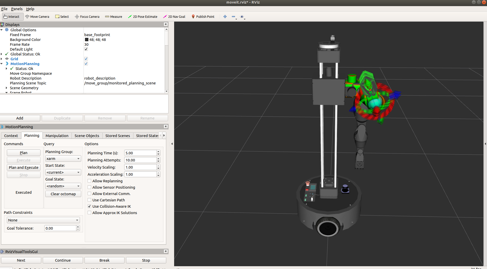
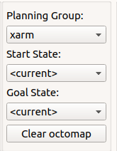
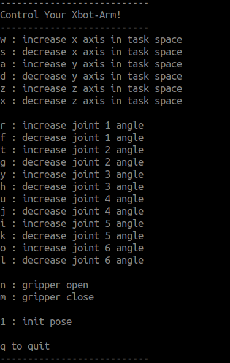
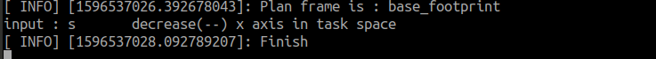

# 快速上手机械臂

本章节将介绍如何使用moveit和Rviz快速设定目标状态、进行路径规划和控制机械臂执行路径，以及使用带moveit解算的键盘控制脚本控制机械臂的运动。

## 启动机械臂和moveit

在运行程序前，请确保`机器人附近0.7米范围内无任何障碍物`。

按“Ctrl Alt T”打开新的命令行终端，在终端内输入以下命令启动机械臂的驱动程序：

```
roslaunch xbot_arm_driver xbot_arm_driver.launch
```

下面可以启动机械臂的moveit相关解算程序，新开终端，在终端中输入以下命令：

```
roslaunch xbot_arm_moveit_config xbot_arm_moveit_planning_execution.launch 
```

启动后，可以在显示器上看到Rviz界面显示的机械臂状态与实际机械臂的状态一致。

## 使用Rviz界面控制机械臂

可以在Rviz界面里设置目标点，让机械臂进行路径规划和轨迹执行。

第一小节启动的RViz界面如下图所示：

 


Rviz的右侧面板显示的机器人的模型和状态，左下角是“MotionPlanning”面板。鼠标点击“Planning”按钮切换到planning界面，可以看到信息如下图：

 


中间“Planning Group”选择“xarm”， “Start State”选择“current”， “Goal State”鼠标点击下拉菜单选择“random”,可以看到右侧面板中机器人随机生成了一个目标状态(橙色机械臂)。

 

 

若此机械臂目标状态显示无红色碰撞提醒，则可点击“commands”标签内的“Plan”按钮进行路径规划：

 

点击后，若有可执行路径，则可在右侧面板看到规划出的轨迹路径。若没有可执行路径，或者该目标状态不是自己想要的状态，可以重新在“Goal State”下鼠标点击下拉菜单选择“random”，重新生成一个目标状态进行plan。

plan结束后，点击“Execute”执行按钮控制真实机械臂的执行规划出的轨迹，机械臂会逐步运动到目标状态。真实机械臂运动过程中，Rviz里的机械臂状态也会跟着更新，最终到达目标位置后，代表机械臂开始状态的绿色机械臂也会更新到目标位置处。下图是机械臂运动到目标位置的效果图。

 


**注意：**若某次执行完轨迹后，RViz里的绿色初始状态橙色目标状态没有与黑色的实际机器人状态重合，如下图所示：

 

则在设置新的目标前，需要在“Start State”鼠标点击下拉菜单选择“current”， “Goal State”鼠标点击下拉菜单选择“current”，让开始状态和目标状态与当前位置一致。

 


## 使用键盘控制机械臂

启动机械臂和moveit后，启动键盘控制脚本，可以通过键盘控制机械臂的末端在x-y-z空间内进行前后左右上下的移动，也可控制每个关节进行旋转。

“Ctrl Alt T”新开一个终端，在终端内输入以下命令后回车：

```
rosrun xbot_arm_teleop xbot_arm_teleop_keyboard
```

按照命令窗口提示的信息按键，可以控制机械臂运动

 


**注意**：

- 当您控制机器人运动发现机器人无反应时，请检查鼠标是否定位在上图所示的命令窗口且处于英文输入法状态。
- 当按键“wsadzx”控制机械臂在x-y-z空间内移动无反应时，可能是因为目标位置属于机械臂不可达状态，请按其他按键控制向其他方向移动。
- 由于路径规划和执行需要时间，请在终端显示“Finish”信息后再按下一个按键。

 

- 数字按键"1"是控制机械臂返回到初始位置(竖直向下)，所以注意不要靠近机械臂，防止碰撞。


