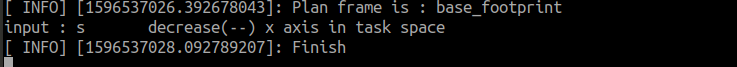

# 深入使用机械臂

## ROS和Moveit!简介

ROS（Robot Operating  System，下文简称“ROS”）是一个适用于机器人的开源的元操作系统。它提供了操作系统应有的服务，包括硬件抽象，底层设备控制，常用函数的实现，进程间消息传递，以及包管理。它也提供用于获取、编译、编写、和跨计算机运行代码所需的工具和库函数。ROS  的主要目标是为机器人研究和开发提供代码复用的支持。ROS是一个分布式的进程（也就是“节点”）框架，这些进程被封装在易于被分享和发布的程序包和功能包中。ROS也支持一种类似于代码储存库的联合系统，这个系统也可以实现工程的协作及发布。这个设计可以使一个工程的开发和实现从文件系统到用户接口完全独立决策（不受ROS限制）。同时，所有的工程都可以被ROS的基础工具整合在一起。

MOVEit！是目前针对移动操作最先进的软件。它结合了运动规划，操纵，三维感知，运动学，控制和导航的最新进展。它提供了一个易于使用的平台，开发先进的机器人应用程序，评估新的机器人设计和建筑集成的机器人产品。它广泛应用于工业，商业，研发和其他领域，是最广泛使用的开源软件的操作，并已被用于超过65个机器人

**注意**：本产品出厂时已安装好ROS系统和Moveit!相关，并对软件运行环境进行了配置，用户可直接按照后面的章节内容使用xbot-arm相关ROS功能包。

## xbot-arm功能包集简介

xbot-arm上位机程序都以ROS功能包的形式提供，共包含五个ROS功能包：

| ROS功能包              | 主要功能                                                     |
| ---------------------- | ------------------------------------------------------------ |
| xbot_arm_description   | 包含xbot-arm机械臂的模型描述文件和URDF坐标转换等内容。       |
| xbot_arm_driver        | 机械臂的驱动程序，负责与机械臂的实时通讯和控制执行。         |
| xbot_arm_moveit_config | 包含用于moveit!运动轨迹解算的各种配置文件、算法文件以及启动入口文件等内容。 |
| xbot_arm_teleop        | 包含机械臂键盘控制脚本。                                     |
| xbot_arm_tutorials     | 包含机械臂的move-group开发的示例程序。                       |

除了上述功能包里提供的程序，用户可按照moveit!官方教程进行二次开发。

可参考教程：

- [MoveIt Quickstart in RViz]( http://docs.ros.org/melodic/api/moveit_tutorials/html/doc/quickstart_in_rviz/quickstart_in_rviz_tutorial.html#) :快速使用RVIZ进行规划和控制roslaunch xbot_arm_moveit_config xbot_arm_moveit_planning_execution.launchroslaunch xbot_arm_moveit_config xbot_arm_moveit_planning_execution.launch

- [Move Group C++ Interface]( http://docs.ros.org/melodic/api/moveit_tutorials/html/doc/move_group_interface/move_group_interface_tutorial.html#) : move group的C++接口

- [Move Group Python Interface]( http://docs.ros.org/melodic/api/moveit_tutorials/html/doc/move_group_python_interface/move_group_python_interface_tutorial.html) : move group的Python接口

- [MoveIt Commander Scripting]( hhttp://docs.ros.org/melodic/api/moveit_tutorials/html/doc/moveit_commander_scripting/moveit_commander_scripting_tutorial.html) : moveit_commander Python软件包为MoveIt提供的功能提供了包装。

各个功能包的启动程序以及接口说明参考后面各个功能包的介绍。

## xbot_arm_description使用说明

机械臂的模型描述文件，包含模型、urdf转换等内容。

“Ctrl Alt t”打开命令行终端，在终端内输入以下命令可启动rviz查看模型和tf变换:

```
roslaunch xbot_arm_description display.launch
```


使用joint_state_publisher的GUI可以查看各个关节的转动限制范围，拖动滑动条，可以看到Rviz右侧面板的机器人的各个关节随着转动。通过这种方式，也可初步判定自己的机器人模型设置是否正确。


## xbot_arm_driver使用说明

该程序包是控制和驱动真实机械臂的代码包，能够实现与机械臂底层的串口通信和与上层moveit的action通信，是进行真实机械臂控制的基础功能包。

### 程序运行说明

由于启动驱动程序后，机械臂会自动恢复到设定好的初始位置，所以应按照**安全须知**章节内容，确保机械臂放在初始位置附近且0.7米范围内无障碍物。

“Ctrl Alt t”打开命令行终端，运行以下命令驱动机械臂节点：

```
roslaunch xbot_arm_driver xbot_arm_driver.launch
```

运行后，机械臂会运动到初始位置。

xbot_arm_driver.launch文件会启动xbot_arm_driver节点，加载机器人的xacro模型文件并启动robot_state_publisher节点，提供的ROS通信接口如下：

### Action Subscribed Topics:

- **/xarm_controller/follow_joint_trajectory/goal ( control_msgs/FollowJointTrajectoryActionGoal )**

发送目标点让机械臂跟随轨迹进行运动。

- **xarm_controller/follow_joint_trajectory/cancel (actionlib_msgs/GoalID )**

发布空的消息可以停止正在执行中的轨迹运动.

------

### Action Published Topics:

- **/xarm_controller/follow_joint_trajectory/feedback ( control_msgs/FollowJointTrajectoryActionFeedback )**

提供action的返回信息。

- **/xarm_controller/follow_joint_trajectory/result ( control_msgs/FollowJointTrajectoryActionResult )**

返回action的结果。

- **/xarm_controller/follow_joint_trajectory/status ( actionlib_msgs/GoalStatusArray )**

提供/xarm_controller/follow_joint_trajectory action的状态信息。

------

### Subscribed Topics:

- **/arm/commands/grip ( std_msgs/Bool )**

控制手爪的开合：false（打开）～true（闭合）。example: 

打开手爪：

```
rostopic pub -1 /arm/commands/grip std_msgs/Bool "data: false"
```


闭合手爪：

```
rostopic pub -1 /arm/commands/grip std_msgs/Bool "data: true"
```

- **/arm/commands/reset (std_msgs/Empty)**

让机械臂回到初始位姿。 example:  

```
rostopic pub -1 /arm/commands/reset std_msgs/Empty "{}"
```


- **/arm/commands/single_joint_control (xarm_driver/SingleJointControl)**

控制单个舵机旋转至特定的角度(rad)。example: 控制1号舵机运动到0.2rad的位置。


------

### Published Topics:

- **joint_states (sensor_msgs/JointState)**

各个关节的当前状态

- **tf (tf2_msgs/TFMessage)**

反映各轴间坐标转换关系

- **/arm/motor_status/data_raw (xarm_driver/MotorStatus)**

各个舵机的当前的状态，速度，位置，负载，温度信息。命令行查看话题信息：

```
rostopic echo /arm/motor_status/data_raw
```

话题显示如下图:


可看到七个舵机当前的位置(location)、速度(speed)、负载(load)、电压（volatge)、温度(temperature)、电流（curent）和错误码（error）信息。舵机编号从左到右为0-6，其中**0号代表手爪舵机，1-6为从肩关节到手肘的六个舵机**。

location值与角度的对应关系为：0-4096对应角度 -180度—180度。机械臂刚启动位于初始位置时，舵机的location值均为2047（0度）左右。


## xbot_arm_moveit_config使用说明

机械臂moveit配置功能包，包含用于运动轨迹解算的各种配置文件、算法文件以及启动入口文件等内容。该功能包提供了两种形式下的move-group启动文件：仿真和非仿真。

### 仿真规划说明

在没有真实机械臂的情况下，可直接运行以下命令进行仿真下的moveit的运动规划和控制验证：

```
roslaunch  xbot_arm_moveit_config demo.launch
```


可参考moveit！教程 [MoveIt Quickstart in RViz]( http://docs.ros.org/melodic/api/moveit_tutorials/html/doc/quickstart_in_rviz/quickstart_in_rviz_tutorial.html#) 里的内容进行机械臂的运动规划和测试。

### RViz控制真实机械臂

首先按照**xbot_arm_driver使用说明** 小节的内容启动机械臂驱动。

```
roslaunch xbot_arm_driver xbot_arm_driver.launch
```

新开终端，输入以下命令启动move-group和Rviz

```
roslaunch xbot_arm_moveit_config xbot_arm_moveit_planning_executioroslaunch 
```

同样可参考moveit教程进行控制： [MoveIt Quickstart in RViz]( http://docs.ros.org/melodic/api/moveit_tutorials/html/doc/quickstart_in_rviz/quickstart_in_rviz_tutorial.html#) 

## xbot_arm_teleop使用说明

仿真环境下运行：

- 启动demo.launch 

  ```
  roslaunch  xbot_arm_moveit_config demo.launch
  ```

- 启动键盘控制脚本：

  ```
   rosrun xbot_arm_teleop xbot_arm_teleop_keyboard 
  ```

使用真实机械臂时运行顺序：

- 启动机械臂驱动

  ```
  roslaunch xbot_arm_driver xbot_arm_driver.launch
  ```

- 启动move-group和RViz

  ```
  roslaunch xbot_arm_moveit_config xbot_arm_moveit_planning_execution.launch 
  ```

- 启动键盘控制脚本

  ```
   rosrun xbot_arm_teleop xbot_arm_teleop_keyboard 
  ```

按照命令窗口提示的信息按键，可以控制机械臂各个关节的旋转和机械臂末端关节在x-y-z坐标系下进行前后左右上下的移动。

 

**注意**：

- 1. 当您控制机器人运动发现机器人无反应时，请检查鼠标是否定位在上图所示的命令窗口且处于英文输入法状态。

- 2. 当按键“wsadzx”控制机械臂在x-y-z空间内移动无反应时，可能是因为目标位置属于机械臂不可达状态，请按其他按键控制向其他方向移动。

- 3. 由于路径规划和执行需要时间，请在终端显示“Finish”信息后再按下一个按键。



## xbot_arm_tutorials使用说明

包含使用move_groupC++接口编写的greet_demo，详细的move_group接口教程参考moveit官网：

- [Move Group C++ Interface]( http://docs.ros.org/melodic/api/moveit_tutorials/html/doc/move_group_interface/move_group_interface_tutorial.html#) : move group的C++接口

该示例程序可以用于仿真或者真实机械臂。

仿真环境下运行：

- 启动demo.launch 

  ```
  roslaunch  xbot_arm_moveit_config demo.launch
  ```

- 启动示例程序greet_demo：

  ```
   rosrun xbot_arm_tutorials greet_demo 
  ```

使用真实机械臂时运行顺序：

- 启动机械臂驱动

  ```
  roslaunch xbot_arm_driver xbot_arm_driver.launch
  ```

- 启动move-group和RViz

  ```
  roslaunch xbot_arm_moveit_config xbot_arm_moveit_planning_execution.launch 
  ```

- 启动示例程序greet_demo

  ```
   rosrun xbot_arm_tutorials greet_demo 
  ```

启动上一小节的驱动和moveit程序后，可以运行提前编好的Greet_demo示例程序。新开一个终端，输入以下命令后回车运行：

程序运行后，可以看到机械臂抬起到胸部位置，然后进行“张开手爪——闭合手爪——末端竖直向下移动7厘米——末端竖直向上移动7厘米——回到初始位置"一系列运动。同时可以看到显示器Rviz里的机械臂状态跟随实际的机械臂位置进行移动。

 


