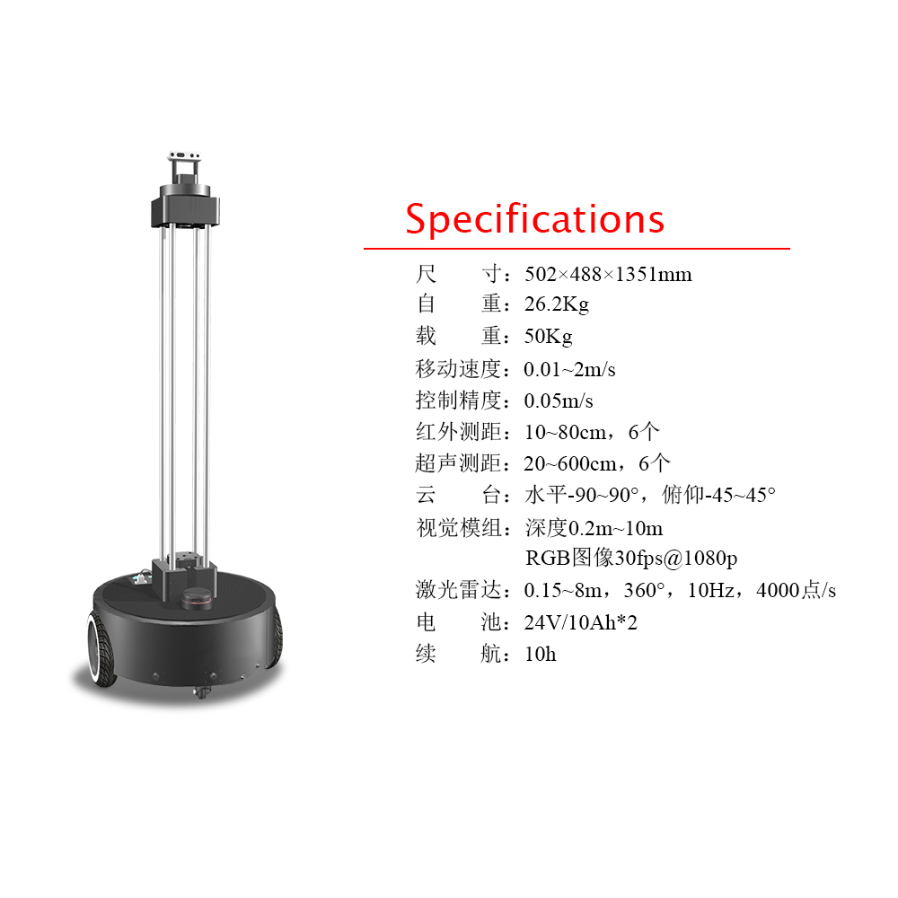
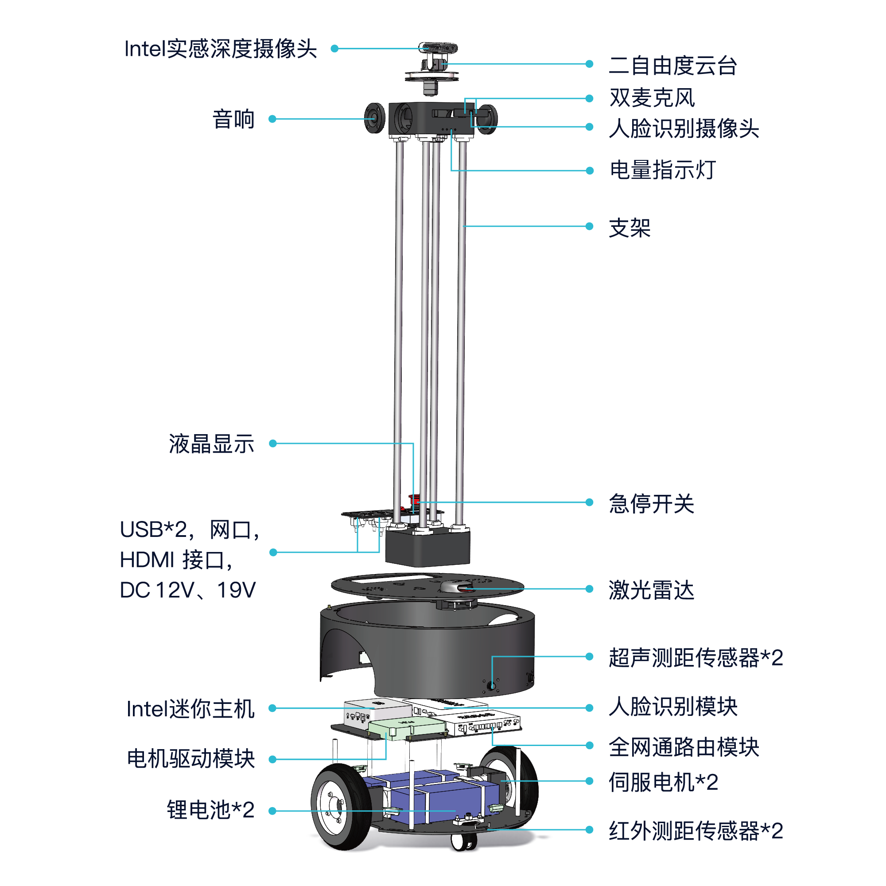
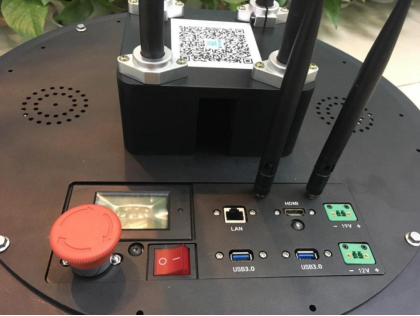
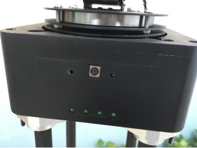

# 认识机器人

## 快速认识XBot-U

XBot-U机器人是一款面向高校与科研院所研发的双轮差分式移动机器人。

机器人配备了当前移动机器人市场上主流的多种传感器与精准的控制器，能实现机器人的自主定位、导航、规划以及多种交互功能。

作为XBot-U机器人的研发与生产厂商，重德智能是一家由**中国科学院软件研究所**机器人组孵化的智能机器人技术企业。

重德智能的使命在于为更多的机器人研究学习与爱好者提供开源好用的ROS机器人软硬件平台。

重德智能为XBot-U机器人开发了稳定的运动控制器与传感器数据融合及运动解算，并将所有的软件算法融合进入ROS的软件包中。

除此之外，XBot-U还针对性的适配和对接了目前ROS社区当中开源的大部分移动机器人算法，真正做到**会ROS就会使用我们的机器人**。

XBot-U机器人平台将是您室内移动机器人应用的不二选择。




## 产品组成

### 产品清单

| 产品组件                           | 数量 |
| ---------------------------------- | ---- |
| XBot-U机器人主机                   | 1台  |
| 机器人控制平板（已预装控制APP）    | 1台  |
| Realsense RGBD摄像头（附固定螺钉） | 1台  |
| XBot-U机器人标准充电器             | 1台  |

### 机器人主机

XBot-U机器人主机由很多部件构成，其硬件组成如下图所示：



### 机器人控制平板

配套的机器人控制平板可以帮助您在不方便携带PC端的情况下对XBot-U机器人进行简单运动控制、人脸注册管理等操作。你也可以在自己的Android设备中下载并安装UXBot助手APP实现相应的功能。关于机器人控制平板与UXBot助手APP的使用，可参看[app使用说明](app)。

### Realsense RGBD摄像头

附带Realsense RGBD摄像头可以帮助您获取机器人四周的图像与深度信息。 使用前将Realsense RGBD摄像头安装到XBot-U机器人顶端的云台上即可。具体的安装方法请参看[开箱指引](open)。

### XBot-U机器人标准充电器

XBot-U机器人随机附送标准充电器一只，当机器人顶部的电量指示灯只剩下一个灯亮时，说明机器人电量即将耗尽，此时您可使用该充电器对机器人进行充电。

XBot-U机器人标准充电器输入为100-240Vac 1.5A，输出为29.4Vdc 3A。需要充电时，请**先行关闭机器人电源（按下船型开关）**，然后打开充电口保护盖，插入充电器，然后再将充电器插头插入插线板即可。

充电器指示灯红色表示正在充电，绿色表示已充满，机器人一次正常充满预计耗时10小时左右。你也可以通过下方的液晶显示面板查看机器人的电量情况。

机器人的正常工作电压为20.5V~29.4V，当液晶显示面板指示在29.4V表示满电，**接近20.5V时则表示即将没电，请您及时为机器人充电。**

## 产品特点

### 稳定、可靠的运动控制

XBot-U机器人运动电机采用先进的PID鲁棒性控制算法，提供稳定、可靠的机器人运动控制，配以高减速比的高精度电机，机器人运动速度可控制到0.01m/s的精度，最小速度达0.01m/s，最大速度达2m/s。具有加速时间短，制动效果明显等的多方面优秀特性。

### 完备的驱动软件支持

我们为XBot-U机器人提供完备的驱动软件，采用国际通用的驱动软件框架和通信协议，能够提供50Hz频率以上的数据心跳包传输和快速精准地数据编码解码功能，使机器人的运动状态控制精度到达20ms以上，从而机器人能够更加迅速地响应用户算法的控制。

### 自主建图定位与导航

XBot-U机器人具备室内环境下的自主建图定位与导航功能，该功能让机器人在室内实现完全自主的同步建图和定位，从而机器人能够根据用户需求，在任意位置之间自由穿梭行走，同时在导航过程中精准避障，全自主规划行走路径。

### 超长续航与自主充电

XBot-U机器人配备高达26Ah的超大容量电池，续航时间最高可达24小时。未来还将支持用户预约返回充电和自主返回充电模式，实现机器人智能管理自身的能量，在能量不足时自动返回充电桩充电。

### 高性能计算能力

XBot-U配备高性能的CPU计算能力，搭载Intel i5高性能处理器、大内存主机，能满足大多数场景下的计算需求。

### ROS系统全支持

XBot-U机器人软件框架专为ROS系统定制，可运行ROS系统下的所有软件和算法，运动控制和规划算法完全支持ROS系统协议，为更多的学习和开发者提供通用的算法验证和应用落地的平台。

### 搭载高精度人脸识别盒子

由腾讯优图技术支撑的人脸识别盒子集成在机器人底盘内部，使机器人拥有国际前沿最为先进的人脸识别功能，识别率高达99.7%以上。经过重德对XBot-U机器人的移植和定制，用户只需要注册人脸、获取人脸识别结果两个简单的步骤，即可轻松实现人脸识别。

### 搭载语音交互模块

XBot-U上集成了科大讯飞的语音识别、语音合成、语音交互等多种强大的语音类智能模块，经过对机器人系统的移植，出厂的机器人已经具备简单的对话功能，而且还能根据用户的配置，实现指定场景下的语音交互。

## 机器人相关配置信息

以下项目在机器人出厂时均已配置好，**不需要您再次配置**，您只需了解这些信息即可，以方便您更好的使用本产品。

### 路由器信息

每一台XBot上均配备有一台工业级的路由器，路由器支持双频以及3G网络。默认情况下，机器人是不连接外部网络，只在自身的局域网内运行和通讯。

路由器的配置信息如下：

| 管理ip地址   | 192.168.8.1                   |
| ------------ | ----------------------------- |
| 管理密码     | admin                         |
| 局域网ip段位 | 192.168.8.100~192.168.8.250   |
| 无线网ID     | xbot-network-*(*为机器人编号) |
| 无线网密码   | xbot1234                      |

### 机器人主机信息

机器人主机信息如下：

| 固定Ip地址     | 192.168.8.101              |
| -------------- | -------------------------- |
| ROS_MASTER_URI | http://192.168.8.101:11311 |
| ROS_HOSTNAME   | 192.168.8.101              |
| 系统用户       | xbot                       |
| 用户密码       | xbot1234                   |

## 了解更多设备支持

在XBot-U所搭载的大部分基础传感器和设备之外，机器人还留有丰富的接口环境提供给使用者进行扩展使用，让XBot-U具有更多的可能性。

### USB通用设备

XBot-U具备两个USB3.0接口，该接口直接连接到机器人的大脑，即机器人主板上。依据外接设备的特性和功能，在设备厂商支持ROS驱动以及通用USB接口的前提下，用户可以将该设备接入到机器人上。

在使用机器人时，可以将鼠标和键盘通过USB3.0口接入，进行系统操作。

还可以使用指令：

```bash
lsusb
```

来查看设备的接入状态，接入之后能够看到列表当中有该设备的唯一接口编号，然后根据厂商提供的ROS驱动程序，将启动入口代码贴入launch文件中进行统一启动。

### HDMI接口

除了通用USB接口之外，机器人还留有HDMI显示接口。某些需要从显示器上查看机器人的实际运行效果的时候，可以使用HDMI连接线连接电脑和显示器进行测试开发。

### 预留的电源接口

有些设备除了需要连接接口进行数据传递之外，还可能需要提供一定的电源。在此，XBot-U提供了两种标准电压的电源接口，即：

19V 5A x1

12V 5A x1


## 开机前须知

请您务必在使用XBot-U机器人之前阅读本节。**当您暂时不使用XBot-U机器人时，请务必切断电源。如果机器人正在连接鼠标、键盘、显示器等设备，请按下急停开关，以防止误操作导致机器人移动，拖拽您的设备。**

### 认识急停开关

为了保证机器人运行的绝对安全，每台机器人都配备工业级标准的旋转红色急停按钮，用于紧急情况下给机器人电机断电。**在任何情况下，拍下该按钮，都将能够切断机器人电机电源，保证运行安全。**

### 如何开机与关机

每一台XBot-U机器人都内置了Ubuntu操作系统，相当于一台小型的计算机，因此，您可以像使用个人计算机电脑一样使用机器人。

 


 


机器人底盘上红色船型开关为机器人的启动开关。按下启动开关后，机器人电源接通，此时机器人上的液晶面板会实时显示当前机器人的电压、功率等信息。

经过一小段时间的Ubuntu操作系统启动及机器人初始化命令执行之后（约20秒），云台位置归位，机器人前方的指示灯点亮，整个机器人完成启动。

与此同时，XBot-U也会打开自身的无线热点。您可在PC或者手机的Wifi列表中查看到以xbot-network-*命名的WiFi热点，其中星号是您XBot-U机器人的编号。

机器人的关机只需要按下底盘上的启动开关即可。此时机器人掉电，所有功能均不可用。

## 开机常规检查

一台正常启动的XBot-U机器人，启动完成之后，我们一般需要检查机器人的如下状态：

1. 机器人电源液晶显示板，查看机器人的电压，功率等信息。

2. 检查急停开关状态，根据即将的操作合理选择按下或者弹起急停开关。

3. 激光雷达：默认开机初始化时启动了激光雷达，开机启动后，激光雷达正常应该处于不停的旋转状态。

4. 电量指示灯，电量指示灯指示机器人的当前电量，从左至右每一颗灯表示25%的电量，以亮2颗灯为例，即表示当前机器人还有25%~50%的电量，因此当只有一颗灯亮时，请您及时充电。

5. 云台状态，上电后，机器人初始化程序默认复位水平云台和竖直云台到0度。

 

## 开机并使用平板简单控制机器人

组装完机器人之后，您就可以开始使用了。最简单的使用方法就是通过搭载的平板上的UXbot助手APP来控制机器人。

UXbot助手APP目前可以通过app来查看机器人的状态、控制机器人移动、查看摄像头图像、人脸注册等功能。

app功能一直在持续升级改进，后续将为大家提供更多的功能。

1. 首先，我们需要开机启动机器人，按机器人底盘上的红色船型开关。进行开机检查。

2. 开机正常后，拿出平板，首先设置wifi网络。将wifi连接到机器人的无线网络：“xbot_network-bj*”。wifi密码为xbot1234。

3. 找到UXbot助手 APP并打开应用，当APP显示“已连接到ROS服务器”之后，就可以通过APP来使用机器人了。

APP控制机器人人运动时，因为是人工控制状态，机器人不会自动避障，因此建议将机器人放到宽敞空旷的场所进行，遇到紧急情况，请按下机器人急停按钮。

如果对APP使用需要详细指导，请查看下一章[机器人APP的使用](app)。

