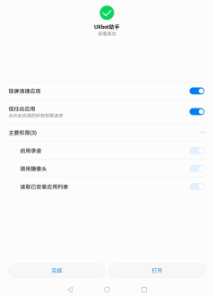
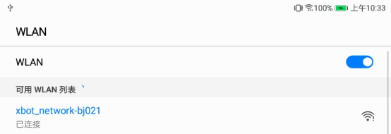
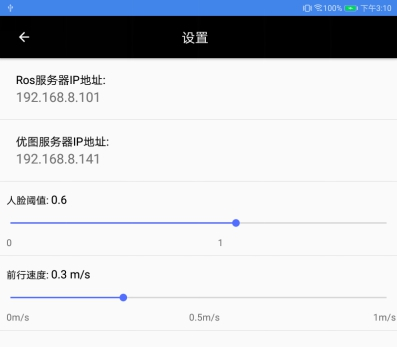
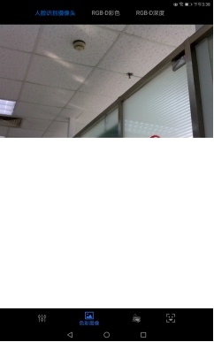
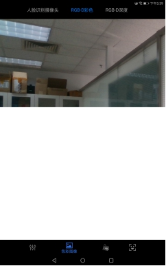
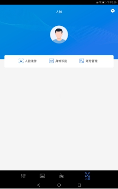
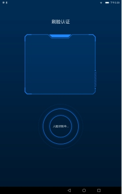

# 使用机器人APP快速上手机器人

目前我们提供了Android应用”UXbot助手APP“来与XBot进行交互。 

UXbot助手是面向用户的操作终端，方便用户实时掌控XBot状态以及对XBot进行交互操作。

用户可以从UXbot助手上了解当前XBot-U机器人的电量，摄像头俯仰角度，摄像头平台的旋转角度。

用户也可以通过UXBot助手来调节XBot的摄像头俯仰角度、摄像头平台旋转角度。

用户可以通过界面上的摇杆控件，来控制XBot-U机器人进行移动，还可以实时查看XBot上的摄像头拍摄到的图像。

**提示：该APP的也可以安装到您的Android手机上运行，操作方法和效果相同。**

## 安装UXbot助手APP

请登录重德智能官网，下载app安装。目前app仅支持andriod系统。

APP安装时，请注意：

1. 在手机进行APP安全检测时，请选择信任该APP，勾选“我已充分了解该风险，继续安装”，且选择“继续安装”。

2. 在安装过程中，请选择“信任此应用”给APP赋权限。请注意一定要给“调用摄像头”的权限，否则人脸模块功能将不可用。

 

按照提示，完成安装即可。“UXBot助手APP”的图标如下图：

​		

## 网络连接

由于UXbot助手APP是XBot-U机器人的工具APP。在使用之前，我们需要如下操作：

1. 首选要开启XBot-U机器人电源开关，等待XBot-U机器人完成启动（大约30秒左右）。启动后，我们可以观察激光雷达传感器开始不停的旋转，电源指示灯也亮起。

2. 拿出手机或者平板，在WLAN网络中，找到“xbot_network-bj*”类似命名的无线网络，并连接。*这里指代的是机器人的出厂编号，该编号可以从机器人底盘的二维码上查看得到。

 

3. 连接网络之后，就可以启动UXbot助手APP了。

4. 启动之后，APP弹出“ROS服务器连接成功”，则说明APP已经成功与机器人连接，下面就可以开始使用“UXBot助手APP”来控制机器人了。

当app显示“ros服务器未连接”提示时，首先请检查机器人是否正常启动，然后检查手机或者平板是否连接了机器人WLAN网络，**再将当前的app进程在后台清理掉，最后重启app。**此时一般就能够显示“ROS服务器连接成功”提示信息了。

此时，就可以正常使用app来控制机器人了。

## 设置

 

- **ROS服务器IP地址**

  Ros服务器IP地址默认是192.168.8.101.一般不需要修改，除非当XBot-U机器人主机的IP地址修改，否则不需要修改。

- **人脸识别盒子服务器IP地址**

  人脸识别盒子服务器IP地址默认是192.168.8.141.一般不需要修改，除非当XBot-U机器人中内置的人脸识别盒子中的IP地址修改，否则不需要修改。

- **设置人脸识别阈值**

  设置人脸识别时，当返回值confidence的返回值高于人脸识别的阈值设置时，我们认定为识别成功。

- **设置遥控基准速度**

  “前进速度”即设置机器人运动时的速度。配合“方向控制轮盘”来控制机器人的运动。

## XBot-U机器人状态查看与控制

当UXBot助手连接上ros服务器后，可以在"状态"界面实时查看到Xbot的状态，包括电量，摄像头俯仰角度，摄像头平台旋转角度(即云台角度)等。

用户可以通过关闭或打开电机电源，来操作电机电源的开关。当电机电源处于开启状态时，可以在“控制”界面使用摇杆控件来操作机器人运动。

当电机电源关闭时，不能使用摇杆控件来操作Xbot进行移动。用户还可以手动调节云台角度和摄像头角度。

点击app底部的“状态”标签，可以查看XBot-U机器人状态。

 

### 电池电量显示

“剩余电量”显示的即为机器人剩余的电池电量状态。当电量小于25%时，请注意需要连接电源充电。

### 水平云台垂直云台位置显示与控制

“水平云台角度”：显示的即为当前水平云台的角度信息。用手拖动滑块可以改变角度，机器人会随之调整水平云台角度，实现类似人类“转脖子”的动作。水平云台左右旋转的角度是90度。

“垂直云台角度”：显示的即为当前垂直云台的角度信息。用手拖动滑块可以改变角度，机器人会随之调整垂直云台角度，实现类似人类“低头抬头”的动作。垂直云台向下可以低头60度，向上仰头30度。

### 重置xbot云台状态

“重置”按钮，可以将“水平云台角度”和“垂直云台角度”重置为0度。

### 方向控制轮盘

图中圆形区域即为“方向控制轮盘”，用来控制机器人移动时的方向。

- l 0度方向：右转

- l 90度方向：前进

- l 180度方向：左转

- l 270度方向：后退

说明：“方向控制轮盘”只控制方向，运动的速度需要在“设置”中进行设置。

### 急停开关控制

图中，“急停开关”开启时，相当禁用了机器人运动功能，此时操作“方向控制轮盘”，机器人不动。

“急停开关”关闭时，操作“方向控制轮盘”，机器人按照指示的方向运动。

## XBot-U机器人摄像头图像查看

### 人脸识别摄像头图像查看

 

### 深度摄像头RGB-彩色图像查看

 

## 人脸管理与识别

 

### 人脸注册

当需要给机器人录入新的注册用户是，就可以按照以下操作步骤即可完成人脸注册：

人脸--->人脸注册--->输入用户ID--->采集人脸图像--->确认注册。

注册完成之后，才能在身份认证中被识别出来。

注意：

1. 注册时，请输入字母或数字，目前暂不支持汉字
2. 使用app注册后的在ros下话题输出的识别结果是一个代码。

### 身份识别

身份识别在机器人应用中一般结合应用场景，与语音识别、运动导航等融合使用。APP中只提供基本的检测功能，即识别出人脸图像所对应的注册用户的ID。该功能的使用很简单，只需要按照如下步骤操作即可：

人脸--->身份识别--->将人脸置于采集图框--->识别成功提示且输出用户ID。

 

 

### 账号管理

账号管理用于对已经注册的用户进行查看、编辑、删除等管理操作。app通过如下列表的方式展示机器人上已经注册过的用户信息。我们还可以通过APP添加注册用户，编辑注册用户信息，删除注册用户等操作。

 

