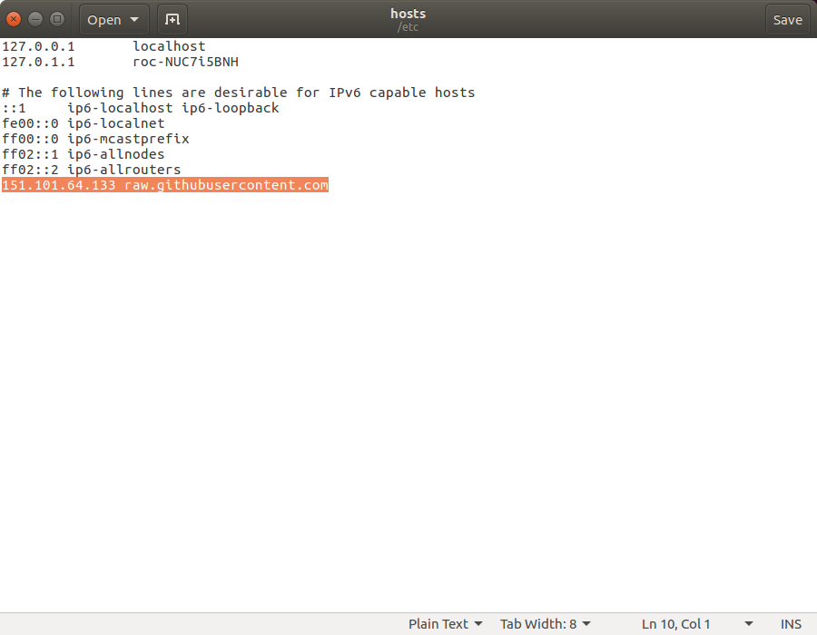

# Ubuntu安装ROS

本教程介绍在ubuntu系统上安装ROS的简单方法。

你也可以直接参照[ROS官方](http://wiki.ros.org/kinetic/Installation/Ubuntu)给出的安装方法。

该教程的版本为ubuntu16.04和ROS Kinetic。

以下命令都是在已经安装好的ubuntu16.04系统上打开的命令行中运行的。

### 第一步：设置软件源

这里使用中科大的备份ROS源。

```bash
sudo sh -c '. /etc/lsb-release && echo "deb http://mirrors.ustc.edu.cn/ros/ubuntu/ `lsb_release -cs` main" > /etc/apt/sources.list.d/ros-latest.list'
```

### 第二步：设置软件安装keys

```bash
sudo apt-key adv --keyserver 'hkp://keyserver.ubuntu.com:80' --recv-key C1CF6E31E6BADE8868B172B4F42ED6FBAB17C654
```

### 第三步：本机更新软件源

```bash
sudo apt-get update
```

### 第四步：安装ROS

这里推荐直接安装桌面完整版。

```bash
sudo apt-get install ros-kinetic-desktop-full
```

### 第五步：设置环境，验证安装完成

```bash
echo "source /opt/ros/kinetic/setup.bash" >> ~/.bashrc
source ~/.bashrc
```

此时，你就可以在命令行中键入

```bash
roscore
```

并能正常运行了，说明ROS安装完成了。

### 第六步：安装ROS依赖和编译库

```bash
sudo apt install python-rosdep python-rosinstall python-rosinstall-generator python-wstool build-essential
sudo apt install python-rosdep
```

先运行

```
sudo rosdep init
```

然后运行

```
rosdep update
```

如果出现：

```
reading in sources list data from /etc/ros/rosdep/sources.list.d
ERROR: unable to process source [https://raw.githubusercontent.com/ros/rosdistro/master/rosdep/osx-homebrew.yaml]:
	<urlopen error [Errno 111] Connection refused> (https://raw.githubusercontent.com/ros/rosdistro/master/rosdep/osx-homebrew.yaml)
ERROR: unable to process source [https://raw.githubusercontent.com/ros/rosdistro/master/rosdep/base.yaml]:
	<urlopen error [Errno 111] Connection refused> (https://raw.githubusercontent.com/ros/rosdistro/master/rosdep/base.yaml)
ERROR: unable to process source [https://raw.githubusercontent.com/ros/rosdistro/master/rosdep/python.yaml]:
	<urlopen error [Errno 111] Connection refused> (https://raw.githubusercontent.com/ros/rosdistro/master/rosdep/python.yaml)
ERROR: unable to process source [https://raw.githubusercontent.com/ros/rosdistro/master/rosdep/ruby.yaml]:
	<urlopen error [Errno 111] Connection refused> (https://raw.githubusercontent.com/ros/rosdistro/master/rosdep/ruby.yaml)
ERROR: unable to process source [https://raw.githubusercontent.com/ros/rosdistro/master/releases/fuerte.yaml]:
	Failed to download target platform data for gbpdistro:
	<urlopen error [Errno 111] Connection refused>
Query rosdistro index https://raw.githubusercontent.com/ros/rosdistro/master/index-v4.yaml
ERROR: error loading sources list:
	<urlopen error <urlopen error [Errno 111] Connection refused> (https://raw.githubusercontent.com/ros/rosdistro/master/index-v4.yaml)>

```

则是由于国内直通github网站被墙引起的，可通过以下方法解决：

首先修改本地的/etc/hosts文件

```
sudo gedit /etc/hosts
```

在末尾加上一行：

```
151.101.64.133   raw.githubusercontent.com
```



然后再运行 rosdep update，此时应该会显示成功。

```
reading in sources list data from /etc/ros/rosdep/sources.list.d
Hit https://raw.githubusercontent.com/ros/rosdistro/master/rosdep/osx-homebrew.yaml
Hit https://raw.githubusercontent.com/ros/rosdistro/master/rosdep/base.yaml
Hit https://raw.githubusercontent.com/ros/rosdistro/master/rosdep/python.yaml
Hit https://raw.githubusercontent.com/ros/rosdistro/master/rosdep/ruby.yaml
Hit https://raw.githubusercontent.com/ros/rosdistro/master/releases/fuerte.yaml
Query rosdistro index https://raw.githubusercontent.com/ros/rosdistro/master/index-v4.yaml
Skip end-of-life distro "ardent"
Skip end-of-life distro "bouncy"
Skip end-of-life distro "crystal"
Add distro "dashing"
Add distro "eloquent"
Add distro "foxy"
Skip end-of-life distro "groovy"
Skip end-of-life distro "hydro"
Skip end-of-life distro "indigo"
Skip end-of-life distro "jade"
Add distro "kinetic"
Skip end-of-life distro "lunar"
Add distro "melodic"
Add distro "noetic"
Add distro "rolling"
updated cache in /home/roc/.ros/rosdep/sources.cache
```

如果第一次运行就成功，则忽略此解决办法。

### 第七步：现在就可以尽情的使用啦。