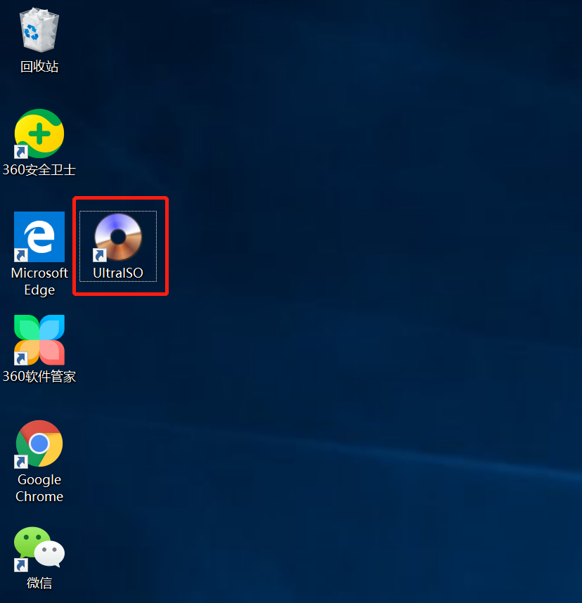
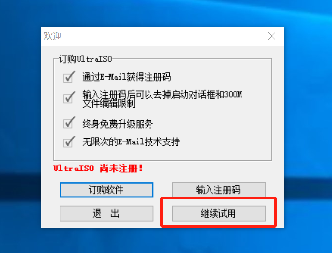
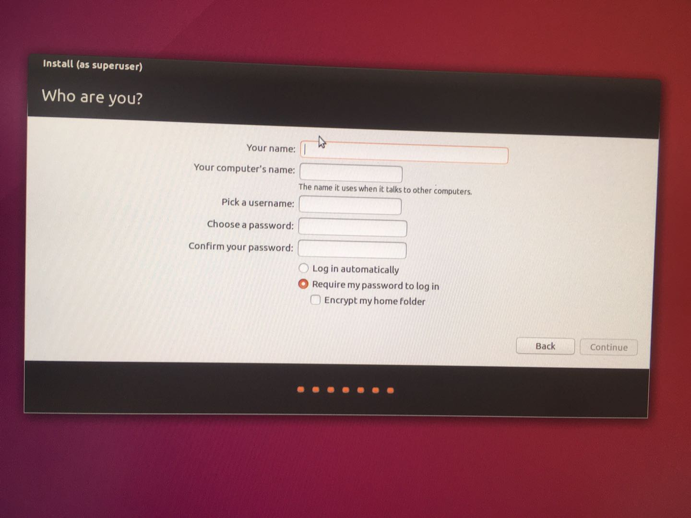

# 安装Ubuntu操作系统

## 准备工作

1. 一台windows系统机器，用于为安装制作系统镜像。
2. 一个可以用于格式化的U盘，大于8Gb，切记可以格式化！
3. 一台笔记本电脑或者台式机，可以已经安装了windows或其他系统，但请保证有大于20Gb的硬盘空间。

## 制作安装镜像

### 第一步：下载镜像

前往[ubuntu官方网站](https://ubuntu.com/download/alternative-downloads)去下载官方发布的系统镜像，这里我们选择[Ubuntu 16.04 LTS (Xenial Xerus)](http://releases.ubuntu.com/16.04.6/)

### 第二步：下载安装UltraISO软件

### 第三步：打开镜像

使用ultraISO软件打开下载好的ubuntu系统镜像

### 第四步：烧录镜像

电脑插入U盘，点击菜单启动->写入硬盘镜像->选择你插入的U盘。

注意此处硬盘驱动器一定要选择你插入的U盘，否则选错了就会格式化了其他的盘。

请保证U盘可用于格式化。

至此就安心等待写入完成，我们就做好了一个Ubuntu的系统安装启动盘了。

## 安装系统

### 第一步：开机进入临时启动选择

将做好的系统启动U盘插入需要装系统的机器，开机后按BIOS的启动选项键，一般是F10或F12，具体根据屏幕提示。

### 第二步：选择U盘启动

键盘上下选择USB启动，也就是从刚才做的系统启动盘启动。

### 第三步：选择安装系统。

### 第四步：选择我不需要连接网络，然后continue。

### 第五步：不勾选安装第三方软件，然后continue

### 第六步：选择安装方式

选择安装并保存原有的windows操作系统，如果没有别的系统的话可直接选择擦除硬盘安装，有其他系统的切勿擦除硬盘，保存双系统安装。

### 第七步：分配安装盘

为系统分配硬盘，请保证有大于30Gb的分配，然后点击安装。

### 第八步：选择时区

请选择上海时区或者直接打入shanghai。

### 第九步：设置用户名和密码。

### 第十步：等待安装完成即可。

## 启动系统

安装完成后就可以直接重启系统了。

对于安装双系统的会在进入系统前让选一个系统启动，上下箭头选择Ubuntu回车即可。单系统的直接进入。

进入系统后可连接无线网，点击右上角的wifi图标，选择wifi连接即可。

同时按Ctrl+Alt+t键即可打开命令行（也叫终端）。

