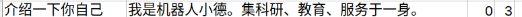

# 智能交互

机器人上配备有人脸识别和语音交互智能功能，下面将逐一为您介绍机器人这两项功能的使用。

## 人脸识别

人脸识别功能主要分为注册人脸，管理人脸和识别人脸三个部分。接下来将依次为您介绍它们的使用方法。

### 注册人脸

注册人脸分为人脸图片注册和实时拍照注册两种方式。

首先，将您的机器人连接显示器与键盘鼠标。因为机器人的开机自启动程序已经占用了人脸识别摄像头，所以要先在机器人的终端上输入如下指令终止全部服务：

```bash
sudo service xbot stop
```

释放人脸识别摄像头之后，继续输入下面指令启动ros：

```
 roscore
```

接下来就是任意从下面的两种人脸注册方式中选择一种进行人脸注册。目前支持使用摄像头交互注册和使用已有的照片注册两种方式，命令分别如下：


#### 使用摄像头交互进行注册:

```bash
 rosrun xbot_face face_register.py camera
```

执行以上命令就会打开一个摄像头窗口，在窗口中能够清楚的看到图像信息。此时您需要用鼠标点击摄像头窗口（此时窗口就处于激活状态），然后将人脸置于窗口中间，调整人脸在窗口中的位置和清晰度，合适时，按下R键，此时摄像头窗口的画面将会定格。（友情提示，使用非人脸，会提示人脸数据提取失败，以下示意图为处理后，请勿模仿）

 


然后返回到终端，命令窗口会提示您输入姓名拼音，如"xjpcnew03"(注意要加双引号)并回车，如果下一行返回的是0，表示注册成功，其后只需要鼠标点击摄像头窗口并按Q或者直接在终端键入ctrl+c即可退出人脸识别程序，此时就完成了一次人脸注册。

 


注册的信息可以通过在浏览器中直接输入接口http://192.168.8.141:8000/management/userids返回，查看返回结果是否包含刚刚注册的id：xjpcnew03。

 

#### 使用照片进行注册:

```
rosrun xbot_face face_register.py image [user_name] 
```

使用已有的照片进行人脸注册，需要设备上已经有了待注册用户的照片，此时我们只需要键入以下命令，并输入待命名的用户名（如xjimage01）：

 rosrun xbot_face face_register.py image xjimage01

回车执行命令之后，会弹出一个文件选择窗口，提示选择人脸照片文件：

 


根据人脸照片路径，选择照片即可完成注册。注册成功，返回0.

 


### 人脸注册错误码

其它常见的人脸注册返回值如下表定义：

| Ret（Int） | 备注                                                    |
| ---------- | ------------------------------------------------------- |
| 0          | 正常                                                    |
| 1          | 请求超时                                                |
| 2          | 识别/核身解析结果错误                                   |
| 3          | 识别解析结果错误                                        |
| 4          | 识别解析相似度错误                                      |
| 5          | 输入信息错误                                            |
| 6          | 无该Userid对应信息                                      |
| 7          | 获取注册人脸图片数据错误                                |
| 8          | Base64解码错误                                          |
| 9          | 人脸数据提取失败（使用非人脸进行注册时会提示该信息）    |
| 10         | 删除人脸失败                                            |
| 11         | 图片过大，不超过初始配置大小（1280,720）                |
| 12         | 文件不存在                                              |
| 13         | 人脸图片打开失败                                        |
| 14         | 人脸已存在（注册人脸时method=normal情况下，userid重复） |
| 15         | 未检测到网卡                                            |
| 16         | 输入信息不合法                                          |
| 17         | 一键开门失败                                            |
| 18         | 文件读取失败                                            |
| 2019       | 恢复出厂设置失败                                        |
| 2020       | 数据清除失败                                            |
| 2021       | 获取日志列表失败                                        |
| 22         | MAC地址不匹配                                           |

 

### 识别人脸

注册完人脸之后，如果摄像头画面中出现有注册过的人脸，机器人就能够识别出相应的信息。

注意，如果您之前停止了机器人的服务，现在需要使用一键启动脚本将它们重新启动起来。一键启动指令为：

```bash
roslaunch xbot_bringup xbot-u.launch
```

我们在机器人或者从机上运行下面的指令，即可查看机器人当前识别的人脸结果。

```bash
rostopic echo /xbot/face_result
```

执行以上命令之后，会一直不停的输出以下格式的信息：

```
face_exist: False
name: "UNKNOWN"
 confidence: 0.0
```

当无人脸置于机器人人脸识别摄像头视阈范围，那么则会输出：

```
face_exist: False
name: "UNKNOWN"
confidence: 0.0
```

当机器人的人脸识别摄像头捕获到人脸信息时，会进行识别，并输出识别结果、匹配的注册用户名以及把握度信息。

```
face_exist: True
name: "xijing"
confidence: 0.632823
```


### 人脸注销

#### 注销指定用户

注销指定用户，建议在注销之前，通过http://192.168.8.141:8000/management/userids接口查询已经注册的用户id。下图中的Userids后面的数组记录的即为注册用户的id。

 

假设删除xjnew03用户，那么执行命令，返回为0则表示注销成功：

```
rosrun xbot_face face_logout.py xjnew03
```

 


再次访问http://192.168.8.141:8000/management/userids接口查询已经注册的用户，已经没有xjnew03，该用户已经成功被注销。

#### 注销所有用户

注销所有用户则只需要输入参数all：

```
rosrun xbot_face face_logout.py all
```

 


## 语音交互

机器人中已经配置好了语音交互模块，使用该模块只需在机器人或者从机上调用相应的service，并修改相应的请求参数，即可打开内置的语音交互模块。

由于机器人出厂前已经进行了语法构建，所以xbot_talker目录下已经存在cache文件目录，用户无需进行构建语法操作，可直接进行测试。若没有cache文件，则需要在终端输入

```
roslaunch xbot_talker build_grammar.launch 
```

 进行语法构建，cache文件夹里包含语法生成的文件以及各种识别日志等缓存文件和调试信息，可定期删除此文件，此文件删除后，需要重新运行上述命令，用户修改命令词后，也需要重新运行此命令。


### 播放指定的语音文件

您还可以让机器人播放语音文件，mode:1 表示播放模式为将文字转化为语音具体的指令为：

```
rosservice call /xbot/play "loop: false
mode: 1
audio_path: '~/catkin_ws/xbot_talker/assets/wav/welcom.wav'
tts_text: ''"
```

其中audio_path后面是您想要播放的语音文件的路径，可自行修改。

### 将输入的文字转化为语音

您可以让机器人播放您输入的文字，只需要在机器人终端中输入如下指令启动/play服务即可，mode:2 表示播放模式为将文字转化为语音：

```
rosservice call /xbot/play "loop: false
mode: 2
audio_path: ''
tts_text: '请和我打招呼'"
```

其中您可以将‘请和我打招呼’替换为任何您想要播放的文字。语音播放成功后，终端会输出相应的提示：

```
success: True
```

在输入指令时，您可以使用Tab键来自动补全指令，以避免指令输入错误。补全指令后您只需修改相应参数即可。

### 对话和语音控制

/chat服务提供了与机器人进行对话以及通过语音控制机器人的交互功能。运行以下命令，即可进行交互：

```
rosservice call /xbot/chat "start_chat: true"
```

执行该指令后，机器人会在一段时间内发出“嘟——嘟——”声，您在听到声音之后即可以开始与机器人交谈。

结束对话时需要告诉机器人“关闭”。在机器人接收到语音输入的关闭指令后，会结束对话。

初始配置的机器人已经能够回答一些简单的问题，包括：你好、你多大了、你是谁、你叫什么名字、你会什么、介绍一下你自己等等，如果要设置更多问答以及更丰富的交互场景，您可以按照4.2.4小结的教程进行自定义对话内容。


初始配置的部分对话内容如下，用户可输入含有关键词的语音，与机器人进行交互。例如，如果问机器人“你几岁了？”，由机器人就会根据已定义好的回答，回应“我已经三岁啦”；命令机器人“向前走”，机器人就会回答“好的”并向前移动一小段距离。

### 自定义对话内容

用户可以通过修改以下两个配置文件自定义对话内容。

#### 修改xbot_talker/userconfig/grammar.bnf语法文件。

bnf语法使用一种结构描述了用户可能说出的语言范围和构成模式。简单来说，机器人只能够识别该文件中定义的关键词。该文件可用WPS打开并编辑。打开文件后，用户可直接在的最后添加自定义的关键词，例如，添加关键词“你有弟弟吗”“你弟弟是谁”：

 

关键词之间用“| ”分隔开，“!id”后面小括号里的数字，依次往后加1即可，最后用分号“；”结束。

#### 修改xbot_talker/defaultconfig/answer_dic.csv文件，添加新的交互词典。


|      |                            |
| ---- | -------------------------- |
|      |  |

打开answer_dic.csv表格文件，在文件末尾添加自定义的交互信息。


每一行代表一组问答，第一栏代表“问答的关键词”，必须与grammar.bnf里的定义一致，否则无法进行有效识别。第二栏代表机器人回答的语句，语句最后以句号结尾，若语句分为好几句，中间也应尽量以句号作为停顿，避免使用英文逗号作为标点。例如：

第三栏数字代表机器人要执行的动作，比如前进，后退，向左旋转，向右旋转等。目前机器人可进行的动作以及数字编码都可参照answer_dic.csv前面的设定进行设定。例如0代表机器人不执行任何动作，1代表关闭对话，3代表向前走一步，4代表向后退一步……

第四栏数字代表动作模式，目前支持的数字模式：0表示在执行动作前播放语音和3只播放语音不执行任何动作。

修改完以上两个配置文件之后，需要先进性语法构建：需要在终端输入：

```
roslaunch xbot_talker build_grammar.launch
```

接着重新启动xbot-u.launch后，便可进行测试。


## 调节机器人的输出音量

如果需要调节机器人喇叭音量，请通过外界显示器，点击ubuntu系统屏幕右上角喇叭图标，选择Sound Settings。

选择Output标签页，调节Output volume调节输出音量；点击Test Sound可以看到左喇叭和右喇叭分别测试的Test按钮，检测左右喇叭是否正常发音，方向是否准确，音量是否洪亮。

 


