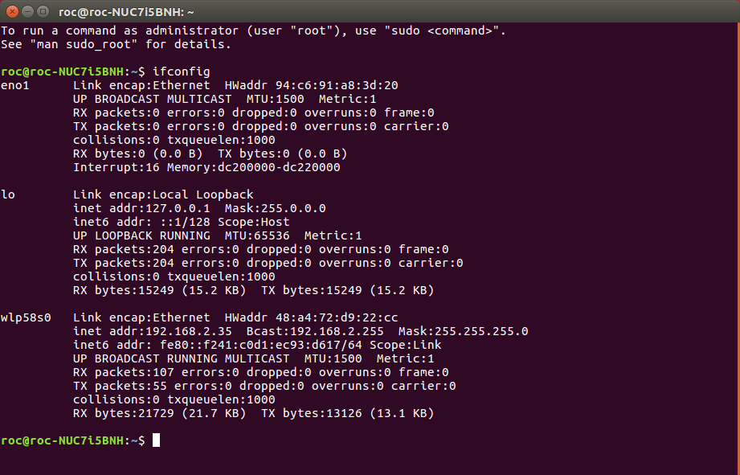
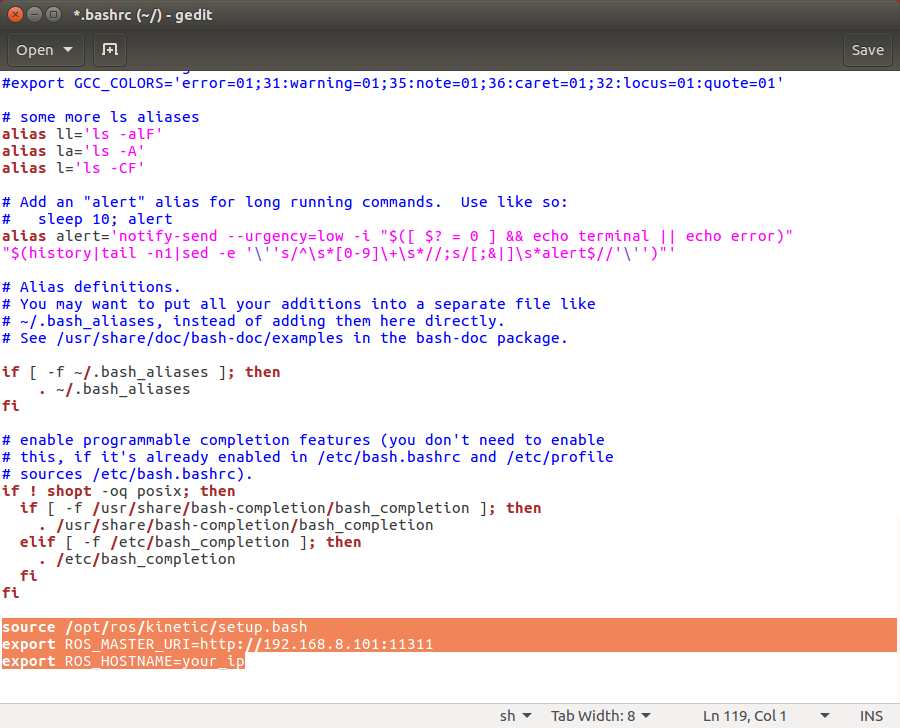

# ROS中使用机器人的三种方法

首先介绍一下在ROS中使用机器人的三种方法：

1. 直接使用机器人本体
2. ssh远程登录
3. ROS网络联机

| 方法               | 优点                                                         | 缺点                                           |
| ------------------ | ------------------------------------------------------------ | ---------------------------------------------- |
| 直接使用机器人本体 | 程序直接在机器人本身上运行<br />方便可视化编辑修改文件<br />可以运行可视化调试程序 | 需要鼠标键盘显示器<br />机器人没办法大范围运动 |
| ssh远程登录        | 机器人可以自由运动<br />不需要鼠标键盘显示器                 | 没办法可视化调试                               |
| ROS网络联机        | 机器人可以自由运动<br />不需要鼠标键盘显示器<br />可以可视化调试 | 偶尔受网络质量影响                             |

## 直接使用机器人本体

这种方法不需要额外的笔记本电脑，也不需要额外的配置。

直接鼠标键盘显示器往机器人上一插，就可直接使用，此时机器人本体的工控机就相当于一台电脑。

## ssh远程登录

该方法需要一台笔记本电脑或者主机，按照前面安装[操作系统](install-ubuntu)方法装好系统，但是不需要安装ROS。

然后连接外网安装ssh软件

```
sudo apt install ssh
```

然后断开外网，电脑连接机器人的无线网络xbot-network-bj**，密码xbot1234。

此时打开命令行，远程登录机器人：

```bash
ssh xbot@192.168.9.18
```

输入密码xbot1234，即可进入机器人的命令行，然后就可使用了。

以上登录ssh到机器人上可以多次运行，相当于在机器人上打开了多个命令行。

## ROS网络联机

### 安装环境

该方法需要一台笔记本电脑或者主机，按照前面安装[操作系统](install-ubuntu)和[安装ROS](install-ros)的方法同时装好系统和ROS。

### 安装软件

装好机器后，连接外网，打开命令行，安装git，ssh

```bash
sudo apt install git ssh -y
```

### 创建ROS工作空间

```
mkdir -p ~/catkin_ws/src
```

然后下载机器人的ROS包

```bash
cd ~/catkin_ws/src
git clone -b kinetic-devel https://github.com/DroidAITech/xbot.git
```

然后编译程序

```bash
cd ~/catkin_ws
rosdep install --from-paths src --ignore-src --rosdistro=kinetic -y
catkin_make
```

### 配置ROS联机

编译成功后，将笔记本网络断开外网，电脑连接机器人的无线网络xbot-network-bj**，密码xbot1234。

打开命令行，运行

```
ifconfig
```

可以看到



记下无线网的ip地址，此处记为your_ip，此处我的是192.168.2.35，你连接了机器的ip应该为形式为192.168.8.*的一个地址。

编辑配置文件：

```bash
gedit ~/.bashrc
```

在尾行加入：

source ~/catkin_ws/devel/setup.bash

export ROS_MASTER_URI=http://192.168.2.101:11311

export ROS_HOSTNAME=your_ip



上面如果source /opt/ros/kinetic/setup.bash这一行没有的话，也请加在上面三行之上。

### 测试ROS联机

这样，机器人已经作为ROS主机，笔记本作为ROS从机配置好了。

测试方法可以直接运行：

```bash
source ~/.bashrc
rosnode list
```

因为机器人上开机启动了xbot_bringup/launch/xbot-u.launch程序，在笔记本本地就能看到ROS的节点信息了。