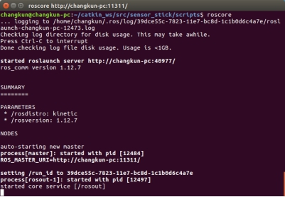

# XBot仿真与教学

我们为ROS初学者和XBot-U机器人的使用者提供了一套仿真环境，可以实现模拟器上对机器人的操作。

***\*注意，\*******\*仿真\*******\*环境与之前配置的从机环境不相同。\****

首先下载、安装依赖和编译ROS-Academy-for-Beginners

```
$ cd ~/catkin_ws/src
$ git clone https://github.com/DroidAITech/ROS-Academy-for-Beginners.git
$ cd ~/catkin_ws
$ rosdep install --from-paths src --ignore-src --rosdistro=kinetic -y  #安装依赖
$ catkin_make  #编译
```

在运行模拟器前，请确认你的gazebo在7.0版本以上，通过以下命令查看

```
gazebo -v
```

如果***\*版本低于7.0\****，请升级gazebo

```
sudo sh -c 'echo "deb http://packages.osrfoundation.org/gazebo/ubuntu-stable `lsb_release -cs` main" > /etc/apt/sources.list.d/gazebo-stable.list'
wget http://packages.osrfoundation.org/gazebo.key -O - | sudo apt-key add –
sudo apt-get update
sudo apt install gazebo7
```

另外建议建议在本地Ubuntu下运行仿真程序。虚拟机对Gazebo的兼容性存在问题，可能会有错误或卡顿。

## 启动XBot模拟器

输入以下命令启动XBot模拟器：

```
roslaunch robot_sim_demo robot_spawn.launch
```

随后Gazebo会启动，如果是第一次启动，可能需要等待几分钟，等待gazebo从服务器上下载模型。

 


Gazebo正常启动，你就能看到XBot-U机器人模型和软件博物馆的场景了。

启动键盘控制程序，你就可以控制机器人前后左右移动了

```
rosrun robot_sim_demo robot_keyboard_teleop.py
```


## SLAM仿真

在XBot的SLAM仿真中提供了Gmapping、Karto、Hector等常见SLAM算法的demo，本节以启动和可视化Gmapping为例，介绍运行方法。

首先确保已经启动XBot模拟器，然后输入

```
roslaunch slam_sim_demo gmapping_demo.launch
```

启动gmappign后，启动RViz查看建图效果

```
roslaunch slam_sim_demo view_slam.launch
```

你可以再启动键盘控制程序，移动机器人，就能够看到地图逐渐建立的过程。

```
rosrun robot_sim_demo robot_keyboard_teleop.py
```

运行效果如下图所示：

 


在slam_sim_demo中还有其他SLAM算法，启动方法和Gmapping相同。

## 已知地图与导航仿真

许多情况下，我们已经建立好了场景地图，只需要机器人执行定位和导航的任务，我们提供了AMCL（定位）、Map_server（已知地图）、和导航相结合的仿真环境。

首先启动XBot模拟器，然后输入启动amcl与导航仿真

```
 roslaunch navigation_sim_demo amcl_demo.launch
```

启动RVIz，查看定位效果

```
roslaunch navigation_sim_demo view_navigation.launch
```

如图所示，绿色箭头表示粒子，点击RViz上方工具栏中的2D Nav Goal，然后在地图上确认目标点位置和方向，机器人就会执行导航任务。

 


## 常见问题

### 执行权限

1. 在通过rosrun运行某个py脚本时，会出现没有任何反应的情况，此时首先进入py文件所在的目录，通过ll命令查看文件的权限。没有执行权限的，请给py文件设置可执行权限。

 

具体的操作命令为：

```
sudo chmod +x *.py
```

不了解linux文件权限，以及不会查询、设置命令的可以自行搜索了解。

## 配置您的个人计算机作为从机

机器人主机本身没有配备显示器，虽然我们也可以通过UXbot app对机器人进行简单控制和状态查看，或者使用自带的HDMI接口外接显示器，但是当我们想进一步对xbot进行了解、研究、或者进行建图、运动规划等高级功能时，这两种方法都有各自的不便之处，因此，我们推荐您通过配置个人计算机（PC端）来实现与机器人的无线通信。配置后的个人计算机与XBot-U机器人构成主从机关系（XBot-U为主机，PC端为从机），同时从机可以SSH远程登录到XBot上，这样，您就可以使用您的个人计算机实现对机器人的控制。

对个人计算机环境的配置主要包括：

1. 安装Ubuntu操作系统

2. 安装ROS环境

3. 配置ROS环境

4. 从机连接到XBot-U主机

5. 部署xbot功能包

### 安装Ubuntu操作系统

Ubuntu是当前ROS运行的标准平台，建议您在笔记本或带无线网卡的台式机上安装Ubuntu系统。

***\*注意：XBot-U机器人主机上已安装好Ubuntu，您只需要在PC上安装。\****

 


每一个ROS版本都存在对应的Ubuntu版本，XBot支持Kinetic、Indigo等主流ROS版本，我们建议您选择Ubuntu16.04与ROS Kinetic。

| Ubuntu版本与ROS版本对照表 |                              |
| ------------------------- | ---------------------------- |
| ROS版本                   | 首选Ubuntu版本               |
| Lunar                     | Ubuntu 17.04                 |
| ***\*Kinetic\****(推荐)   | ***\*Ubuntu 16.04\****(推荐) |
| Jade                      | Ubuntu 15.04                 |
| Indigo                    | Ubuntu 14.04                 |
| Hydro                     | Ubuntu 13.04                 |

清华大学开源镜像网站中Ubuntu16.04下载链接如下：

https://mirrors.tuna.tsinghua.edu.cn/ubuntu-releases/xenial/ubuntu-16.04.6-desktop-amd64.iso

### 安装ROS

安装好Ubuntu系统后，我们可以开始准备安装ROS环境。

####  在Ubuntu系统上，确认初始环境配置正确。

打开Ubuntu的设置->软件与更新->Ubuntu软件->勾选关键字universe, restricted, multiverse三项。

 

“下载自”一栏可以选择速度较快的源，推荐使用国内高校的镜像。

#### 添加sources.list

打开终端，输入

```
sudo sh -c '. /etc/lsb-release && echo "deb http://mirrors.ustc.edu.cn/ros/ubuntu/ $DISTRIB_CODENAME main" > /etc/apt/sources.list.d/ros-latest.list'
```

我们默认添加中国科大的ROS镜像。

#### 添加keys

打开终端，输入

```
sudo apt-key adv --keyserver hkp://ha.pool.sks-keyservers.net:80 --recv-key 421C365BD9FF1F717815A3895523BAEEB01FA116
```

#### 系统更新

```
 sudo apt-get update && sudo apt-get upgrade
```

#### 安装ROS

```
sudo apt-get install ros-kinetic-desktop-full # Ubuntu 16.04
```

请耐心等待直至系统安装配置结束。

### ROS环境配置

#### 初始化rosdep

```
 sudo rosdep init && rosdep update
```


#### ROS环境配置

```
echo "source /opt/ros/kinetic/setup.bash" >> ~/.bashrc
```


#### 安装rosinstall

```
sudo apt-get install python-rosinstall
```


### ROS安装测试

首先启动ROS，输入代码运行roscore：

```
roscore
```

如果出现图9所示结果，则说明ROS已经正常安装和启动。

 

### 从机连接到xbot主机

您的个人计算机通常可以通过“SSH连接”和“ROS主从机配置”两种方式控制XBot-U机器人，这两种方法各有用途。

“SSH连接”是linux系统的功能，其安装和使用就不一一详述。

“ROS主从机配置”即为ros计算机分布式主从通信，是需要安装ros环境之后才能配置。

两者在命令的层级上就不一样，ssh是linux的底层通信，ros主从机通信是ros主机和从机通过订阅话题和服务实现的，其使用的前提是主机的ros必须启动。

关于两者使用的区别，用户可以自己去尝试和查询资料。关于其他的ROS网络的配置教程，，请参考ROS官方wiki社区：http://wiki.ros.org/ROS/NetworkSetup

 

不管何种方式连接机器人，操作机器人的第一步就是开机。启动机器人后，机器人会启动随身WIFI。请在PC上链接WIFI热点***\*：xbot-network-\*，\****其中后面的*是机器人的网络唯一编号(编号在机器人底盘上二维码处可见)，初始密码***\*：xbot1234\****。

### 通过SSH远程连接到机器人

SSH是一种较为常用的远程登录方式，基础格式为：ssh <主机用户>@<主机IP地址>

想通过个人PC远程控制主机，那么我们需要在个人PC上打开一个终端，并输入：

```
ssh xbot@192.168.8.101
```

@符号之前是主机的用户名，@符号之后是主机的IP地址。按照机器人出厂设置，用户名默认为xbot，主机IP地址为192.168.8.101

接着，终端会提示输入密码：

xbot@192.168.8.101's password: 

此时，需要输入xbot的主机密码即可。这里密码输入后不会有任何显示，输入完成直接按回车键即可。

 


ssh远程登录成功后，可以看到如上图所示的信息。尤其最为关键的是看最下面一行的绿色字体部分(表示“用户@机器名”)，已经由个人PC电脑的用户名和机器名（xj@xj-Thinkpad-T470p）变成主机的用户名和机器名(xbot@xbot)，这是最为重要的ssh登录成功的验证手段。

以上方式为最简单的ssh登录，每次新打开一个终端，都需要输入该命令和密码。为了简化操作，您还可以通过配置ssh的公钥私钥来设置免密码登录。有兴趣可自行了解。

此外，在连接机器人的过程中，我们有时会需要打开图形界面，此时我们可以通过-X（X大写）打开图形界面：

```
ssh -X [xbot@192.168.8.101](mailto:xbot@192.168.8.101) 
```

个人PC通过ssh连接机器人主机成功之后，就可以像在主机上一样，键入任何命令来操作机器人了。

### ROS主从环境配置

ROS的主从环境其实是一种分布式通信方式。这里我们讲述ROS主从环境的配置步骤：

#### 查看IP

启动机器人后，机器人会启动随身WIFI，在PC上链接机器人WIFI。

首先，使用下面的命令，分别在XBot与您PC上执行，获取xbot主机和您PC的IP地址：

```
ifconfig
```

[](https://yt.droid.ac.cn/xbot-u/hq/uploads/8b8c1a3c5ac1ff926dd932d23851692c/1.png)图 7–5 通过ifconfig指令查看IP地址

XBot端显示如图 24所示（XBot-U机器人主机的默认IP已在出厂时设定为192.168.8.101）。

类似的，您的PC端也会显示出一个IP地址，应注意，在查看PC端IP时，请务必保证您的PC已经连接上了XBot-U机器人的wifi，同时，为避免以后每次都要重新查看ip,可先配置固定IP。

然后使用ifconfig命令进行查看PC机的IP地址：

 

#### PC端与XBot端通信测试

在开始配置主从关系之前，先测试一下两台机器之间是否能够正常通信。在这里可以使用ping指令，首先测试从XBot端到PC端的连通。在XBot的终端里输入：

```
ping yourpc-ip
```

可以看到：

 


从PC端到XBot端测试时，在PC端输入。

```
ping 192.168.8.101
```

连接成功的效果如下图：

 

双向ping通后，可以开始配置主从关系。

 

#### 配置主从关系

在这里，我们设置Xbot为主机，PC端为从机。

首先在XBot的终端上输入：

```
gedit ~/.bashrc
```

该指令打开.bashrc文件，如果文件中存在之前的配置，我们先将其注释掉，然后加入：

```
export ROS_MASTER_URI=http://192.168.8.101:11311
export ROS_HOSTNAME=192.168.8.101
```

 

保存退出，并在终端上输入：

```
source ~/.bashrc
```

XBot上配置完毕。

 

在PC端上，我们也使用同样命令打开.bashrc文件：

 

```
gedit ~/.bashrc
```

如果存在之前的配置，则先将其注释掉。，再加入：

```
export ROS_MASTER_URI=http://192.168.8.101:11311 #ROS主机(Xbot)IP
export ROS_HOSTNAME=192.168.8.198 #PC的IP,即本机的ip地址
```

 保存退出后，在终端输入：

```
source ~/.bashrc
```

PC端配置完毕。

 此时，主从关系已经全部配置完毕。我们可在XBot端启动ROS节点，然后再PC端上使用rostopic list查看相关话题，如果能够看到终端返回相关话题，则说明配置成功。返回的topic（部分）见下图：

 


### 在从机上部署xbot功能包

为了能够在从机上控制机器人，我们需要在您的个人计算机上部署与XBot-U机器人相同的工作空间。

在PC上打开终端，新建工作空间caktin_ws并对它初始化

```
mkdir -p catkin_ws/src
cd catkin_ws
catkin_make  #初始化工作空间
```

初始化完成后，将xbot机器人上的/home/xbot/catkin_ws/src路径下的xbot功能包全部拷贝到catkin_ws/src下。

 

功能包包括：

| ***\*ROS软件包\****    | ***\*主要功能\****                       |
| ---------------------- | ---------------------------------------- |
| xbot_bringup           | 驱动程序启动入口，包含多个launch文件     |
| xbot_driver            | 底层通讯驱动，收发数据                   |
| xbot_node              | ROS数据封装与分发，运动解算              |
| xbot_msgs              | 软件包集所用到的所有ROS消息类型          |
| xbot_safety_controller | 机器人安全控制程序                       |
| xbot_description       | ROS建模与urdf描述文件                    |
| xbot_tools             | 用于调试、开发以及运行过程的一些工具软件 |
| xbot_face              | 人脸识别程序                             |
| xbot_navi              | SLAM、导航规划程序                       |
| xbot_talker            | 机器人语音交互和对话程序                 |

 

为了防止由于文件权限导致的运行错误，强烈建议您进行py文件的可执行权限验证：

```
cd  ~/catkin_ws/src
find -name *.py |xargs chmod +x
```

 

最后编译工作空间。

```
cd  ~/catkin_ws
catkin_make 
source devel/setup.bash 
```

***\*注意\****：source命令，编译完成后必须刷新一下工作空间的环境，否则可能找不到工作空间。许多时候我们为了打开终端就能够运行工作空间中编译好的ROS程序，我们习惯把source ~/tutorial_ws/devel/setup.bash命令追加到~/.bashrc文件中，这样每次打开终端，系统就会刷新工作空间环境。你可以通过echo "source ~/tutorial_ws/devel/setup.bash" >> ~/.bashrc命令来追加。

有时候如果我们需要单独编译某个功能包，我们也可以使用指令：

```
catkin_make --pkg package_name
```

​	其中，package_name是要单独编译的功能包的名字。当您直接使用catkin_make指令不能通过编译时，可以使用该指令来排查不能通过编译的功能包。 

在xbot系列包中，当直接catkin_make出现问题的时候，您可以按照以下顺序分开编译：

```
catkin_make --pkg xbot_msgs
catkin_make --pkg xbot_talker
catkin_make --pkg xbot_face
catkin_make --pkg xbot_navi
catkin_make
source devel/setup.bash 
```

 

### 在主机上安装sshd

为了远程操控主机，建议主机上安装并开通ssh server。默认机器人上已经安装，如果从机ssh远程登录机器人主机被拒绝，可以按照以下方法进行检查和安装。

#### 检查主机是否安装sshd

```
which sshd
```

如果安装，命令会返回sshd的安装路径，一般为/usr/sbin/sshd；

如果没有安装，则无返回值。

####  如果没有安装，则先安装。

```
sudo apt-get install openssh-server
```

#### 安装完成之后，检查ssh服务是否已启动

```
$ ps aux | grep ssh


```

输出结果出现sshd，则说明安装成功且进程已经开启

#### 查看防火墙是否已关闭

```
sudo ufw status
```

 

要求关闭防火墙，如果防火墙没有关闭，请先关闭防火墙。具体操作可自行搜索。

#### 验证ssh是否成功。

将从机连机器人网络xbot_network-*,并在从机的终端输入：

```
ssh xbot@192.168.8.101
```

如果能返回要求输入密码的界面，表示能正常连接。此处可能遇到许可等问题，属于linux基础知识，请自行搜索解决。

 

看到最后出现xbot@nuc打头的字符时，表示现在从机已经连上了主机。


