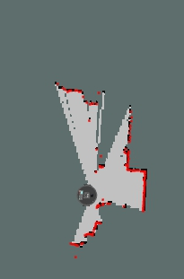
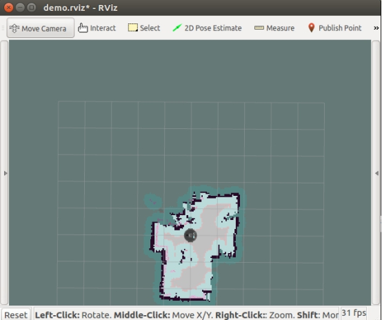
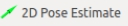
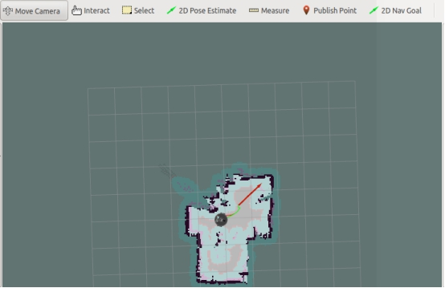

# 机器人SLAM与自主导航

我们在最初的XBot-U的软硬件设计上，都早已充分考虑到了XBot-U对于目前绝大部分建图算法和开源程序的支持特性。

在硬件上，XBot具备标准的双轮差分系统，前后各配置一个万向轮，适应大多数室内的运行环境；激光雷达方面，XBot-U可以与市面上大部分的激光雷达兼容运行，支持所有使用二维激光雷达建图的程序。

在软件上，XBot-U以成为一款最适合中国ROS学者和研究人员使用的机器人软硬件平台为目标，从最原始的驱动软件编写逻辑和优化方法，到其node Package的设置，都按照ROS控制标准好系统标准而完成，以方便您在本平台上测试调试任何在ROS算法程序。

XBot-U机器人具有运动规划功能，可以根据已知地图或运动中建立的地图自主生成运动轨迹。当您打开RViz可视化窗口后，可以直接在窗口上指定目标点，让机器人进行运动规划，并导航至该点。 

> 在运行导航程序之前，请在您的个人计算机上搭建ROS主从环境。
>
> 主机：机器人本体
>
> 从机：您的笔记本电脑

## SLAM建图 

### 启动建图程序

第一步：【从机】连接到XBot-U机器人自带的WiFi，连接方法与前面主从配置部分相同。

第二步：把机器人摆放至合适的位置准备建图 ( 根据任务需求以及场地实际定制)

第三步：【从机】端远程SSH登录到主机上

```
ssh xbot@192.168.8.101 
```

按照提示输入机器人密码xbot1234即可。 

第四步：给机器人定义一个原点，即每次建图和导航时，机器人初始放置的位置和方向，记下来，比如推荐将机器人放在地面瓷砖的某个十字架中心。

第五步：【远程登录的主机】关闭机器人上的自启服务

XBot-U机器人开机时，已经启动了激光雷达，但是在build_map.launch文件中，仍然写有启动雷达的语句，故此可能出现执行上述指令导致雷达停转的情况，此时您可以直接观察激光雷达是否运转，如果停止运转，请按下**ctrl+c终止之前的进程后，再次执行roslaunch xbot_navi build_map.launch 命令一次，观察机器人的激光雷达运转起来则表示建图程序启动成功 。**

```bash
sudo service xbot stop
```

第六步：【远程登录的主机】运行xbot_navi/launch目录下的build_map.launch建图程序。

```
 roslaunch xbot_navi build_map.launch   #使用gmapping建图
```

第七步：【从机】新开一个终端，在从机端运行rviz查看远端机器人建立的地图信息

```
 roslaunch  xbot_navi   rviz_build_map.launch
```

此时可以看到机器人实体和周围的环境的图像。

 

### 移动机器人完成建图

在RViz中，中间区域显示的是XBot-U机器人建立的地图信息，选择上方MoveCamera指令可以调整地图视角，其中，按住鼠标左键拖动可旋转地图。滚动鼠标滚轮可以放大和缩小地图，按住鼠标滚轮拖动可以调整地图位置。

在建图过程中，我们需要控制机器人移动，使机器人搭载的激光雷达扫描整个环境，从而建立地图信息。控制机器人移动的方式很多，可以新开终端输入键盘命令去驱动机器人运动，也可以使用UXbot助手APP的运动轮盘去控制，甚至可以人工推着机器人运动(此时必须是机器人双轮着地运动，不可搬运离地)。目的就是为了让激光雷达能够扫描到整个场地。
下面介绍通过键盘命令控制机器人移动。

在从机上打开一个新的终端（之前的build_map和rviz_build_map命令窗口都不要关闭），输入如下指令：

```
rosrun xbot_tools keyboard_teleop.py
```

**当焦点在该终端上时**，通过键盘上的按键，可以手动控制机器人的移动，按键与机器人运动对照关系如下表：

| 按键 | 运动       |
| ---- | ---------- |
| i    | 向前       |
| k    | 停止       |
| ,    | 向后       |
| j    | 顺时针旋转 |
| l    | 逆时针     |

需要注意的是，建图需要机器人移动，因此接口不适合接入有线设备（如显示器、有线鼠标键盘等），因此在通过键盘命令驱动机器人运动时，建议采用ssh远程控制或者在PC从机上控制的方式。且**在手动控制机器人移动时，机器人不会自主避障，如果将要发生碰撞，可以通过机器人地盘上的红色按钮紧急制动。**

注意：一次建图不成功可以反复进行多次建图。

### 保存地图

保存地图的指令：

```
rosrun  map_server  map_saver  -f  <filename>
```

保存地图既可以在机器人本机上运行{远程ssh登录机器人），也可以直接在从机上运行，保存的地图是在运行以上指令的机器的运行目录中的。

其中，<filename>是地图的名称(没有 <> ),为方便说明，下面使用 "807" 替代。

如果从机出现找不到map_server这个ROS包的错误，请先安装再保存地图：

```
sudo apt install ros-kinetic-map-server
```

保存成功后就可以查看地图，在指令运行的目录下得到两个文件,分别为 filename.pgm 和 filename.yaml，即为保存好的地图。

建议在建图过程中多次运行以上指令保存不同阶段的地图来选用最合适的一张,切记保存地图时的文件名不能相同,否则会自动替换文件。


## 导航

### 配置导航地图参数

将上面保存的地图两个文件移动到机器人本体上的xbot_navi/map文件夹下备用。

机器人的导航功能需要知道当前的空间环境，空间环境是通过之前创建的地图来描述的。

所以，首先我们需要修改导航程序中的地图参数。

在主机上，打开catkin_ws/src/xbot/xbot_navi/launch/下的demo.launch文件进行编辑。

具体操作为，在从机上ssh登录主机。

在ssh登录了主机的界面上运行

```
roscd xbot_navi/launch
vim demo.launch
```

这种方法使用Linux的vim编辑器修改文档中的map_file参数，将上述红色字体地方修改为刚刚保存的地图名，并保存。

```
<arg name="map_file"  default="$(find xbot_navi)/map/filename.yaml" />
```

不会使用vim编辑器的同学请鼠标键盘显示器连接主机自行更改文件。

### 开始简单导航

我们通过一个最简单直观的方式，来实际运行下导航功能。

第一步：将机器人放置到之前建图时定义的原点位置，保持与启动建图时一致的位置和方向，即建图时的那个地面瓷砖的十字架中间。

第二步：配置好导航地图参数之后，我们检查之前打开的所有终端窗口（或者结束各运行的命令，尤其是建图命令）是否关闭，如果没有关闭，建议关闭所有终端窗口。

第三步：接着，新开终端，通过ssh远程登录主机，启动导航功能【机器人上运行】：

```
roslaunch  xbot_navi demo.launch
```

注意：在导航期间，该命令窗口一直保持运行状态，不要关闭和结束运行。

第四步：在从机的命令终端，直接运行导航可视化程序：

```
roslaunch  xbot_navi rviz_demo.launch
```

此时，从机上会出现如下的界面：

 

第五步：在上图所示的rviz界面中，点击按钮，待鼠标状态改变后，在地图上标记原点的位姿（位置和方向）。

第六步：接着，在工具栏点击按钮，在地图可行的区域（粉灰色区域）设置导航目标点的位置。

 

第七步：设置完目标点之后，稍等几秒，rviz中地图上会出现如上图所示的绿色路线，这是导航程序规划的全局路径。稍等片刻，机器人会按照规划的路径自主导航到设定的目标点，完成导航。

 以上仅展示最基本的导航过程，请尽量在有较宽过道的地方运行导航程序。


## 机器人进阶

至此，您就已经掌握了XBot-U机器人的以下所有基础功能了：

1. 基础运动控制
2. 传感器数据获取
3. 里程计解算/odom数据获取
4. 人脸识别程序调用
5. 语音交互程序调用
6. SLAM建图
7. 基础导航

但是，在本手册中以上功能都是作为机器人的基础功能单独呈现，并没有将他们串到一起形成一个完整的应用展示。

所以，除了以上基础功能之外，为了给使用者和开发者一个综合所有基础功能的演示应用的demo，我们在xbot_navi包当中提供了一个demo.launch的启发程序，其中结合了包括机器人基础运动、人脸识别、语音对话交互、机器人SLAM、机器人自主导航等功能在内的几乎所有基础功能。

用户可以自行查看该启发程序的源代码，程序逻辑和功能实现，并在此基础上逐步开发实现自己想要的机器人场景应用。

如果您想了解和学习进阶的使用XBot-U机器人服务应用方法，请前往[XBot-U进阶](http://docs.droid.ac.cn/products/xbotu/stepup)。


